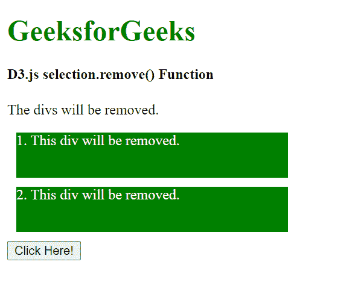
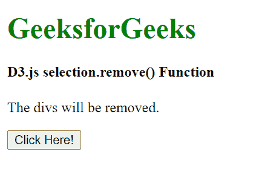
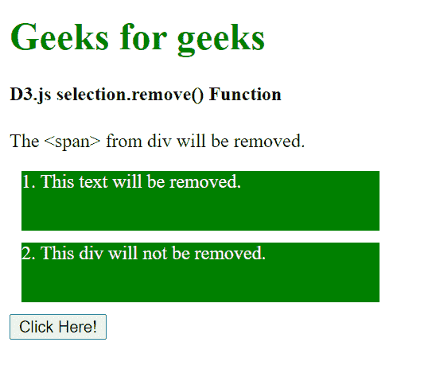
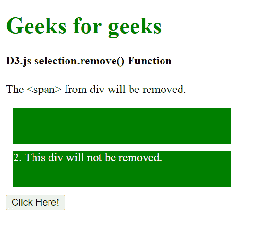

# D3.js 选择.移除()功能

> 原文:[https://www . geesforgeks . org/D3-js-selection-remove-function/](https://www.geeksforgeeks.org/d3-js-selection-remove-function/)

**selection.remove()** 功能用于从文档中移除所选元素，并返回带有移除元素的新选择。此外，新的选择现在从 DOM 中分离出来

**语法:**

```
selection.remove();
```

**参数:**此功能不接受任何参数。

**返回值:**该函数返回新的选择。

**例 1:**

## 超文本标记语言

```
<!DOCTYPE html>
<html lang="en">

<head>
    <meta charset="UTF-8">
    <meta name="viewport" path1tent=
        "width=device-width, initial-scale=1.0">

    <script src="https://d3js.org/d3.v4.min.js">
    </script>

    <style>
        h1 {
            color: green;
        }

        div {
            width: 300px;
            color: #ffffff;
            height: 50px;
            background-color: green;
            margin: 10px;
        }
    </style>

<body>
    <h1>GeeksforGeeks</h1>

    <h4>D3.js selection.remove() Function</h4>

    <p>The divs will be removed.</p>

    <div><span>1\. This div will be removed.</span></div>
    <div><span>2\. This div will be removed.</span></div>

    <button>Click Here!</button>

    <script>
        function func() {
            // Selecting  div and
            // Removing the div
            var div = d3.selectAll("div")
                .remove();
        }
        btn = document.querySelector("button");
        btn.addEventListener("click", func);

    </script>
</body>

</html>
```

**输出:**

**点击“点击这里！”元素:**



**点击“点击这里！”元素:**



**例 2:**

## 超文本标记语言

```
<!DOCTYPE html>
<html lang="en">

<head>
    <meta charset="UTF-8">
    <meta name="viewport" path1tent=
        "width=device-width, initial-scale=1.0">

    <script src="https://d3js.org/d3.v4.min.js">
    </script>

    <style>
        h1 {
            color: green;
        }

        div {
            width: 300px;
            color: #ffffff;
            height: 50px;
            background-color: green;
            margin: 10px;
        }
    </style>

<body>
    <h1>Geeks for geeks</h1>

    <h4>D3.js selection.remove() Function</h4>

    <p>The <span> from div will be removed.</p>

    <div><span>1\. This text will be removed.</span></div>
    <div><span>2\. This div will not be removed.</span></div>

    <button>Click Here!</button>

    <script>
        function func() {
            // Selecting  div and
            // The text inside the div will be removed.
            var div = d3.select("span")
                .remove();
        }
        btn = document.querySelector("button");
        btn.addEventListener("click", func);
    </script>
</body>

</html>
```

**输出:**

**点击点击此处按钮前:**



**点击点击此处按钮后:**

