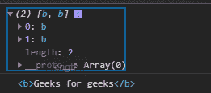
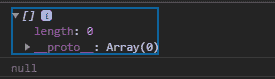

# D3.js 选择.选择()功能

> 原文:[https://www . geesforgeks . org/D3-js-selection-select-function/](https://www.geeksforgeeks.org/d3-js-selection-select-function/)

d3.js 中的 **selection.select()** 函数用于选择与给定选择器匹配的第一个后代元素。如果找不到元素，则函数返回 null。

**语法:**

```
 selection.select(selector);
```

**参数:**上面给定的函数只取上面给定的一个参数，如下所述:

*   **选择器:**这是 HTML 容器或 SVG 标签的名称。

**返回值:**如果找到则返回一个元素，否则返回空值。

下面是上面给出的函数的几个例子。

**示例 1:**

## 超文本标记语言

```
<!DOCTYPE html>
<html lang="en">
<head>
    <meta charset="UTF-8">
    <meta name="viewport"
            path1tent="width=device-width,
                    initial-scale=1.0">
    <title>Document</title>
</head>
<style>
div{
    background-color: green;
    margin-bottom: 5px;
    padding: 10px;
    width: fit-content;
}
</style>
<body> 
    <div>Some text</div>
    <div><b>Geeks for geeks</b></div>
    <div>Geeks for geeks<b>This is from b tag</b></div>
    <div>Some text</div>
  <script src =
"https://d3js.org/d3.v4.min.js">
  </script>
  <script src=
  "https://d3js.org/d3-selection.v1.min.js">
</script>
  <script>
      let selection=d3.selectAll("div").select("b").node()
      console.log(selection)
  </script>
</body>
</html>
```

**输出:**



**示例 2:** 未找到元素时，返回空值。

## 超文本标记语言

```
<!DOCTYPE html>
<html lang="en">
<head>
    <meta charset="UTF-8">
    <meta name="viewport"
            path1tent="width=device-width,
                    initial-scale=1.0">
    <title>Document</title>
</head>
<style>
div{
    background-color: green;
    margin-bottom: 5px;
    padding: 10px;
    width: fit-content;
}
</style>
<body> 
    <div>Some text</div>
    <div><b>Geeks for geeks</b></div>
    <div>Geeks for geeks<b>This is from b tag</b></div>
    <div>Some text</div>
  <script src =
"https://d3js.org/d3.v4.min.js">
  </script>
  <script src=
  "https://d3js.org/d3-selection.v1.min.js">
</script>
  <script>
      let selection=d3.selectAll("div").select("p");
      console.log(selection.nodes());
      console.log(selection.node());
  </script>
</body>
</html>
```

**输出:**

