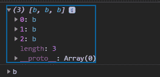
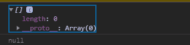

# D3.js 选择. selectAll()功能

> 原文:[https://www . geesforgeks . org/D3-js-selection-selectall-function/](https://www.geeksforgeeks.org/d3-js-selection-selectall-function/)

d3.js 中的**selection all()**函数用于选择与作为参数给出的特定选择器字符串相匹配的所有后代元素。如果没有找到匹配项，则该函数返回 null。

**语法:**

```
selection.selectAll(selector);
```

**参数:**上面给定的函数只取上面给定的一个参数，如下所述:

*   **选择器:**这是要选择的容器的名称。

**返回值:**返回找到元素数组，否则返回空值..

下面是上面给出的函数的几个例子。

**示例 1:** 选择不为空时。

```
<!DOCTYPE html> 
<html lang="en"> 
<head> 
    <meta charset="UTF-8"> 
    <meta name="viewport"
            path1tent="width=device-width, 
                    initial-scale=1.0"> 
    <title>Document</title> 
</head> 
<style>
</style> 
<body>  
    <div>Geeks for geeks
        <b>This text is in bold</b>
        <b>This text is also in bold</b>
    </div>
    <div><b>Geeks for geeks</b></div>
    <div>Some text</div>
  <script src = 
"https://d3js.org/d3.v4.min.js"> 
  </script>
  <script src=
  "https://d3js.org/d3-selection.v1.min.js">
</script>
  <script>
      let selection=d3.selectAll("div").selectAll("b");
      console.log(selection.nodes());
      console.log(selection.node());
  </script> 
</body> 
</html>
```

**输出:**



**例 2:** 当选择为空时。

```
<!DOCTYPE html> 
<html lang="en"> 
<head> 
    <meta charset="UTF-8"> 
    <meta name="viewport"
            path1tent="width=device-width, 
                    initial-scale=1.0"> 
    <title>Document</title> 
</head> 
<style>
</style> 
<body>  
    <div>Geeks for geeks
        <b>This text is in bold</b>
        <b>This text is also in bold</b>
    </div>
    <div><b>Geeks for geeks</b></div>
    <div>Some text</div>
  <script src = 
"https://d3js.org/d3.v4.min.js"> 
  </script>
  <script src=
  "https://d3js.org/d3-selection.v1.min.js">
</script>
  <script>
      let selection=d3.selectAll("div").selectAll("br");
      console.log(selection.nodes());
      console.log(selection.node());
  </script> 
</body> 
</html>
```

**输出:**

