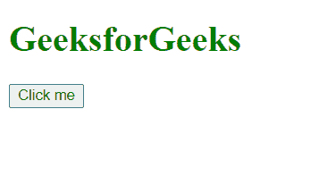
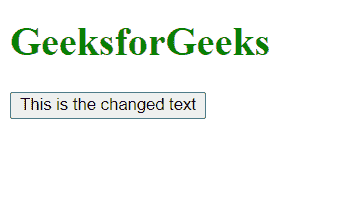
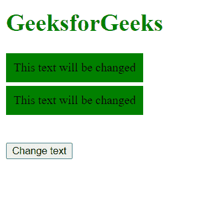
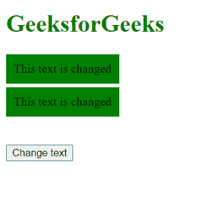

# D3.js selection.text()函数

> 原文:[https://www . geesforgeks . org/D3-js-selection-text-function/](https://www.geeksforgeeks.org/d3-js-selection-text-function/)

d3.js 中的 **selection.text()** 函数用于将文本内容设置为所选元素的指定值，从而替换任何现有的子元素。如果给定的值是常量，那么所有元素都将被赋予该常量值。

**语法:**

```
selection.text([value]);

```

**参数:**该函数只取一个参数，上面给出，下面描述:

*   **值:**要设置的文本内容值。

**返回值:** 该函数不返回值。

**例 1:**

## 超文本标记语言

```
<!DOCTYPE html>
<html lang="en">

<head>
    <meta charset="UTF-8">
    <meta name="viewport" path1tent=
        "width=device-width,initial-scale=1.0">

    <script src="https://d3js.org/d3.v4.min.js">
    </script>
</head>

<body>
    <h1 style="color: green">GeeksforGeeks</h1>
    <div>
        <button>Click me</button>
    </div>

    <script>
        function func() {

            // Sets the text-content of the button
            var chk = d3.select("button")
                .text("This is the changed text");
            var text = document.querySelector("button");
        }
        let btn = document.querySelector("button");
        btn.addEventListener("click", func);
    </script>
</body>

</html>
```

**输出:**

*   **点击按钮前:**

    

*   **点击按钮后:**

    

**例 2:**

## 超文本标记语言

```
<!DOCTYPE html>
<html lang="en">

<head>
    <meta charset="UTF-8">
    <meta name="viewport" path1tent=
        "width=device-width, initial-scale=1.0">

    <script src="https://d3js.org/d3.v4.min.js">
    </script>
</head>

<body>
    <h1 style="color: green;">GeeksforGeeks</h1>
    <div style="background-color: green; 
              width: fit-content; 
              padding: 10px; 
              margin-top: 5px;" class="btn">
        This text will be changed
    </div>

    <div style="background-color: green; 
              width: fit-content; 
              padding: 10px; 
              margin-top: 5px;" class="btn">
        This text will be changed
    </div><br>
    <br>

    <button class="Clickme">Change text</button>

    <script>
        function func() {

            // Selecting all buttons and
            // Setting the text content of the button
            var chk = d3.selectAll(".btn")
                .text("This text is changed");
            var text = document.querySelector("button");
        }
        let btn = document.querySelector(".Clickme");
        btn.addEventListener("click", func);
    </script>
</body>

</html>
```

**输出:**

*   **点击按钮前:**

    

*   **点击按钮后:**

    