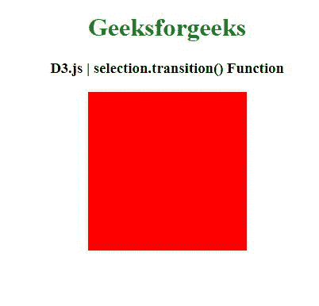
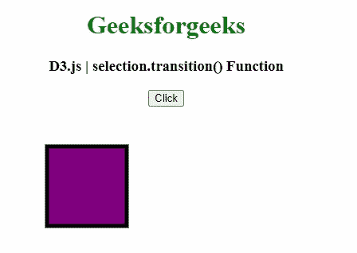

# D3.js 选择.过渡()功能

> 原文:[https://www . geesforgeks . org/D3-js-selection-transition-function/](https://www.geeksforgeeks.org/d3-js-selection-transition-function/)

**D3.js** 中的**选区.过渡()**功能用于获取给定选区上具有指定名称的新过渡。新转场仅与其他同名转场独占。

**语法:**

```
selection.transition([name])

```

**参数:**该功能接受如下参数，如上所述，如下所述:

*   **名称:**此参数为过渡实例。

**返回值:**该函数用指定的名称返回给定选择的新转换。

以下程序说明了 **D3.js.** 中的**选择.转换()**功能

**例 1:**

```
<!DOCTYPE html> 
<html> 
<head> 
    <meta charset="utf-8">
    <script src="https://d3js.org/d3.v4.min.js"> 
    </script>

    <style>
        #GFG {
            height: 200px;
            width: 200px;
            background-color: black;
        }
    </style>
</head> 

<body> 
    <center>
        <h1 style="color: green;"> 
            Geeksforgeeks 
        </h1> 

        <h3>D3.js | selection.transition() Function</h3>

        <div id="GFG"></div>

        <script>
            d3.select("#GFG")
                .transition()
                .style("background-color", "red");
        </script> 
    </center>
</body> 
</html>
```

**输出:**



**例 2:**

```
<!DOCTYPE html> 
<html> 
<head> 
    <meta charset="utf-8">
    <script src="https://d3js.org/d3.v4.min.js"> 
    </script>
</head> 

<body> 
    <center>
        <h1 style="color: green;"> 
            Geeksforgeeks 
        </h1> 

        <h3>D3.js | selection.transition() Function</h3>

        <button onclick="triggerTransition()">Click</button>

        <div>
          <svg width="400px" height="200px">
              <rect
                id="rectArea" x="50" y="50"
                width="100" height="100" stroke="black"
                fill="purple" stroke-width="5"/>
          </svg>
        </div>

        <script>
            function triggerTransition(){
                d3.select("#rectArea")
                    .transition()
                    .delay(100)
                    .duration(2000)
                    .attr("width", "330")
            }
        </script> 
    </center>
</body> 
</html>
```

**输出:**

