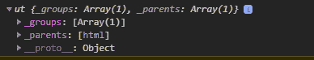
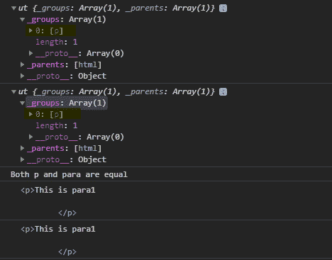

# D3.js 选择器()功能

> 原文:[https://www.geeksforgeeks.org/d3-js-selector-function/](https://www.geeksforgeeks.org/d3-js-selector-function/)

**d3.selector()** 函数用于返回一个函数，该函数返回作为参数给出的元素的第一个后代。

**语法:**

```
 d3.selector(selector)
```

**参数:**该函数只取一个参数，上面给出，下面描述:

*   **选择器:**这是要选择的元素的字符串。

**返回值:**该函数返回一个布尔值。

下面是上面给出的函数的几个例子。

**例 1:**

```
<!DOCTYPE html> 
<html lang="en"> 
<head> 
    <meta charset="UTF-8"> 
    <meta name="viewport"
            path1tent="width=device-width, 
                    initial-scale=1.0"> 
    <title>Document</title> 
</head> 
<style>
    p{
        line-height:5px;
    }
</style> 
<body>  
    <div>

    </div>
    <div>
        <p>This is para1</p>
        <p>This is para2</p>
        <p>This is para3</p>
        <p>This is para4</p>
    </div>
  <script src = 
"https://d3js.org/d3.v4.min.js"> 
  </script>
  <script>
      // Parent of div is HTML 
    var div = d3.select("div").select(d3.selector("div"));
    console.log(div);
  </script> 
</body> 
</html>
```

**输出:**



**例 2:**

```
<!DOCTYPE html> 
<html lang="en"> 
<head> 
    <meta charset="UTF-8"> 
    <meta name="viewport"
            path1tent="width=device-width, 
                    initial-scale=1.0"> 
    <title>Document</title> 
</head> 
<style>
    p{
        line-height:5px;
    }
</style> 
<body>  
    <div>
        <p>This is para1

        <p>This is para2</p>

        <p>This is para3</p>
        </p>
    </div>
  <script src = 
"https://d3js.org/d3.v4.min.js"> 
  </script>
  <script>
      // First descendant of Div 
    var para = d3.select("div").select(d3.selector("p"));
    console.log(para);

      // First descendant of Div 
    var p = d3.select("div").select("p");
    console.log(p);

    console.log("Both p and para are equal");
    console.log(para.node());
    console.log(p.node());

  </script> 
</body> 
</html>
```

**输出:**

