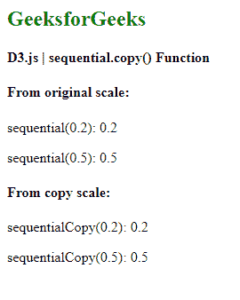
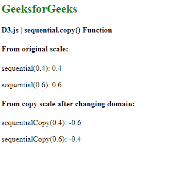

# D3.js 顺序复制()功能

> 原文:[https://www . geesforgeks . org/D3-js-sequential-copy-function/](https://www.geeksforgeeks.org/d3-js-sequential-copy-function/)

**D3.js** 中的**顺序. copy()** **功能**用于构建并返回原始比例的副本。原始比例的任何变化都不会影响拷贝比例，反之亦然。**顺序音阶**类似于连续音阶。在连续的比例中，映射是在域和范围之间以连续的方式完成的。唯一不同的是，该标尺的输出范围由其插值器固定，并且该范围不能改变。

**语法:**

```
sequential.copy()
```

**参数:**此功能不接受任何参数。

**返回值:**该函数返回原始刻度的副本。

下面给出了 D3.js 中**顺序复制()**的几个例子:

**例 1:**

## 超文本标记语言

```
<!DOCTYPE html>
<html>

<head>
    <script src="https://d3js.org/d3.v6.min.js">
    </script>
</head>

<body>
    <h2 style="color:green">
        GeeksforGeeks
    </h2>

    <h4> D3.js | sequential.copy() Function </h4>

    <script>
        var sequential = d3.scaleSequential();

        // Default scale is identity function
        document.write("<h4>From original scale:</h4>")

        document.write("<p>sequential(0.2): ", 
                    sequential(0.2) + "</p>");

        document.write("<p>sequential(0.5): ", 
                    sequential(0.5) + "</p>");

        // Creating copy of the original scale
        var sequentialCopy = sequential.copy();
        document.write("<h4>From copy scale:</h4>")
        document.write("<p>sequentialCopy(0.2): ", 
                    sequentialCopy(0.2) + "</p>");

        document.write("<p>sequentialCopy(0.5): ", 
                    sequentialCopy(0.5) + "</p>");
    </script>
</body>

</html>
```

**输出:**

[](https://media.geeksforgeeks.org/wp-content/uploads/20200824103657/01151.png)

**例 2:** 复制比例的任何变化都不会影响原始比例。

## 超文本标记语言

```
<!DOCTYPE html>
<html>

<head>
    <script src="https://d3js.org/d3.v6.min.js">
    </script>
</head>

<body>
    <h2 style="color:green">
        GeeksforGeeks
    </h2>

    <h4> D3.js | sequential.copy() Function </h4>

    <script>
        var sequential = d3.scaleSequential();

        // Default scale is identity function
        document.write("<h4>From original scale:</h4>");

        document.write("<p>sequential(0.4): ", 
                    sequential(0.4) + "</p>");
        document.write("<p>sequential(0.6): ", 
                    sequential(0.6) + "</p>");

        // Creating copy of the original scale
        var sequentialCopy = sequential.copy();
        sequentialCopy.domain([1, 2]);
        document.write(
        "<h4>From copy scale after changing domain:</h4>");

        document.write("<p>sequentialCopy(0.4): ", 
                    sequentialCopy(0.4) + "</p>");
        document.write("<p>sequentialCopy(0.6): ", 
                    sequentialCopy(0.6) + "</p>");
    </script>
</body>

</html>
```

**输出:**

[](https://media.geeksforgeeks.org/wp-content/uploads/20200824103922/01152.png)