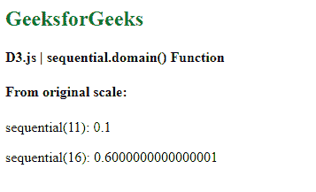
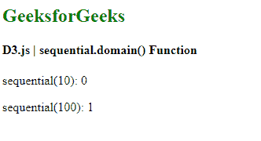

# D3.js 顺序.域()函数

> 原文:[https://www . geesforgeks . org/D3-js-sequential-domain-function/](https://www.geeksforgeeks.org/d3-js-sequential-domain-function/)

**顺序刻度**与连续刻度非常相似。在连续的尺度上，映射在域和范围之间以连续的方式完成。唯一不同的是，该标尺的输出范围由其插值器固定，并且该范围不能改变。

**顺序域()**功能用于设置给定顺序标度的域。域数组总是接受两个数值。

**语法:**

```
sequential.domain([domain]);
```

**参数:**该函数接受如上所述的单个参数，如下所述:

*   **定义域:**设置刻度的最小和最大定义域值。

**返回值:**该函数不返回值。

**例 1:**

## 超文本标记语言

```
<!DOCTYPE html> 
<html lang="en"> 

<head> 
    <meta charset="UTF-8" /> 
    <meta name="viewport"
        path1tent="width=device-width, 
        initial-scale=1.0"/> 

    <script src=
        "https://d3js.org/d3.v6.min.js">
    </script>
</head> 

<body> 
    <h2 style="color:green"> GeeksforGeeks </h2>

    <h4> D3.js | sequential.domain() Function </h4>

    <script> 
        var sequential = d3.scaleSequential()
            // Setting domain to [10,20]
            .domain([10,20]);

        document.write("<h4>From original scale:</h4>");

        document.write("<p>sequential(11): ", 
                    sequential(11) + "</p>");

        document.write("<p>sequential(16): ", 
                    sequential(16) + "</p>");
    </script> 
</body>

</html>
```

**输出:**

[](https://media.geeksforgeeks.org/wp-content/uploads/20200824105736/01153.png)

**示例 2:** 当给定一个域作为字符串数字时，它被解析为数字。

## 超文本标记语言

```
<!DOCTYPE html> 
<html lang="en"> 

<head> 
    <meta charset="UTF-8" /> 
    <meta name="viewport"
        path1tent="width=device-width, 
        initial-scale=1.0"/> 

    <script src=
        "https://d3js.org/d3.v6.min.js">
    </script>
</head> 

<body> 
    <h2 style="color:green"> GeeksforGeeks </h2>

    <h4> D3.js | sequential.domain() Function </h4>

    <script> 
        var sequential = d3.scaleSequential()
            // Setting domain to ["10","100"]
            .domain(["10","100"]);

        document.write("<p>sequential(10): ", 
                    sequential(10) + "</p>");

        document.write("<p>sequential(100): ", 
                    sequential(100) + "</p>");
    </script> 
</body>

</html>
```

**输出:**

[](https://media.geeksforgeeks.org/wp-content/uploads/20200824105905/01154.png)