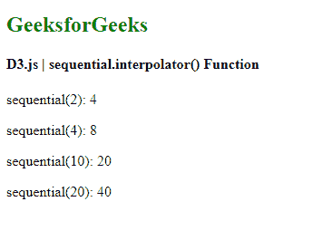
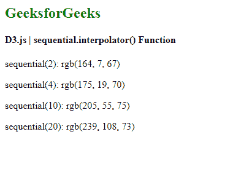

# D3.js 顺序插值器()功能

> 原文:[https://www . geesforgeks . org/D3-js-顺序-插值器-函数/](https://www.geeksforgeeks.org/d3-js-sequential-interpolator-function/)

**顺序刻度**与连续刻度非常相似。在连续的尺度上，映射在域和范围之间以连续的方式完成。唯一不同的是，该标尺的输出范围由其插值器固定，并且该范围不能改变。

d3.js 中的**顺序插值器()**功能用于配置标尺的插值器。如果指定了插值器，它会将标尺的插值器设置为指定的函数，否则会返回标尺的当前插值器。

**语法:**

```
sequential.interpolator([interpolator]);
```

**参数:**该函数接受如上所述的单个参数，如下所述:

*   **插值器:**这取插值器功能。如果未指定插值器，它将返回当前的比例插值器。

**返回值:**这个函数不返回任何东西。

**例 1:**

## 超文本标记语言

```
<!DOCTYPE html>
<html lang="en">

<head>
    <meta charset="UTF-8" />
    <meta name="viewport" path1tent=
        "width=device-width,initial-scale=1.0"/>

    <script src="https://d3js.org/d3.v6.min.js">
    </script>
</head>

<body>
    <h2 style="color:green"> GeeksforGeeks </h2>

    <h4> D3.js | sequential.interpolator() Function</h4>
    <script>
        var sequential = d3.scaleSequential()

            // Setting the interpolator of the scale.
            .interpolator((t) => t * 2);

        document.write("<p>sequential(2): ", 
                    sequential(2) + "</p>");

        document.write("<p>sequential(4): ", 
                    sequential(4) + "</p>");

        document.write("<p>sequential(10): ", 
                    sequential(10) + "</p>");

        document.write("<p>sequential(20): ", 
                    sequential(20) + "</p>");
    </script>
</body>

</html>
```

**输出:**

[](https://media.geeksforgeeks.org/wp-content/uploads/20200824110535/01155.png)

**例 2:**

## 超文本标记语言

```
<!DOCTYPE html>
<html lang="en">

<head>
    <meta charset="UTF-8" />
    <meta name="viewport" path1tent=
        "width=device-width,initial-scale=1.0"/>

    <script src="https://d3js.org/d3.v6.min.js">
    </script>
</head>

<body>
    <h2 style="color:green"> GeeksforGeeks </h2>

    <h4>D3.js | sequential.interpolator() Function</h4>

    <script>
        var sequential = d3.scaleSequential()
            // Setting the interpolator of the scale.
            .interpolator(d3.interpolateSpectral)
            // Setting the domain of the scale.
            .domain([1, 100]);
        document.write("<p>sequential(2): ", 
                    sequential(2) + "</p>");

        document.write("<p>sequential(4): ", 
                    sequential(4) + "</p>");

        document.write("<p>sequential(10): ", 
                    sequential(10) + "</p>");

        document.write("<p>sequential(20): ", 
                    sequential(20) + "</p>");
    </script>
</body>

</html>
```

**输出:**

[](https://media.geeksforgeeks.org/wp-content/uploads/20200824110742/01156.png)