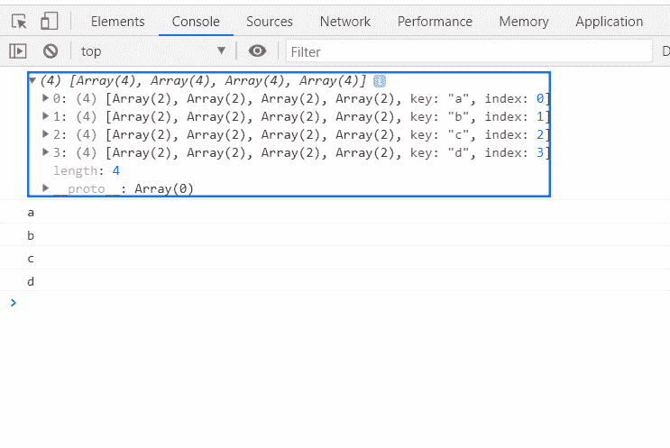

# D3.js stack.keys()方法

> 原文:[https://www.geeksforgeeks.org/d3-js-stack-keys-method/](https://www.geeksforgeeks.org/d3-js-stack-keys-method/)

**stack . keys()方法** 将字符串数组作为参数，并返回堆栈生成器。

**语法:**

```
 stack.keys([keys])

```

**参数:**该方法接受如上所述的单个参数，如下所述。

*   **域:**该参数保存字符串数组作为关键参数。

**返回值:**此方法返回堆栈生成器。

**示例:**

## 超文本标记语言

```
<!DOCTYPE html>
<html>
<head>
    <meta charset="utf-8">
    <script src=
        "https://d3js.org/d3.v5.min.js">
    </script>
</head>

<body>
    <h1 style="text-align: center; color: green;">
        GeeksforGeeks
    </h1>
    <center>
        <canvas id="gfg" width="200" height="200">
        </canvas>
    </center>

    <script>
        var data = [
              {a: 3840, b: 1920, c: 960, d: 400},
              {a: 1600, b: 1440, c: 960, d: 400},
              {a:  640, b:  960, c: 640, d: 400},
              {a:  320, b:  480, c: 640, d: 400}
            ];

        var stackGen = d3.stack()
            // Defining keys
            .keys(["a", "b", "c", "d"])

        var stack = stackGen(data);

        console.log(stack);

        for (i = 0; i < 4; i++) {

            // Displaying keys
            console.log(stack[i].key);   
        }
    </script>
</body>
</html>
```

**输出:**

