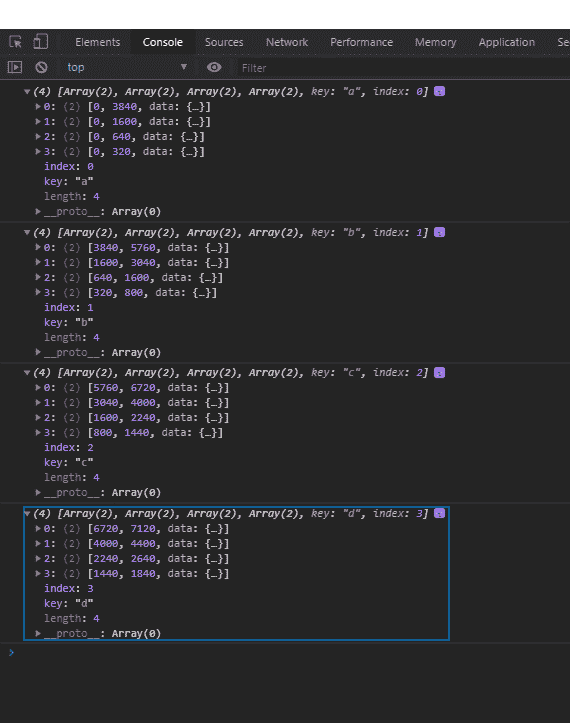

# D3.js 叠加()方法

> 原文:[https://www.geeksforgeeks.org/d3-js-stack-method/](https://www.geeksforgeeks.org/d3-js-stack-method/)

**d3.stack()方法**使用默认设置构建一个新的堆栈生成器。这个堆栈生成器还可以用来创建堆栈。

**语法:**

```html
d3.stack()
```

**参数:**该方法不取参数。

**返回值:**这个方法返回一个新的堆栈生成器，默认设置。

**示例:**

```html
<!DOCTYPE html>
<html>
<head>
    <meta charset="utf-8">

    <script src=
        "https://d3js.org/d3.v5.min.js">
    </script>
</head>

<body>
    <h1 style="text-align: center; color: green;">
        GeeksforGeeks
    </h1>

    <center>
        <canvas id="gfg" width="200" height="200">
        </canvas>
    </center>

    <script>
        var data = [
              {a: 3840, b: 1920, c: 960, d: 400},
              {a: 1600, b: 1440, c: 960, d: 400},
              {a:  640, b:  960, c: 640, d: 400},
              {a:  320, b:  480, c: 640, d: 400}
            ];

        var stackGen = d3.stack()
            .keys(["a", "b", "c", "d"])
            .order(d3.stackOrderNone)
            .offset(d3.stackOffsetNone);

        var stack = stackGen(data);

        for(var i=0;i<4;i++){
            console.log(stack[i]);
        }

    </script>
</body>

</html>
```

**输出:**

