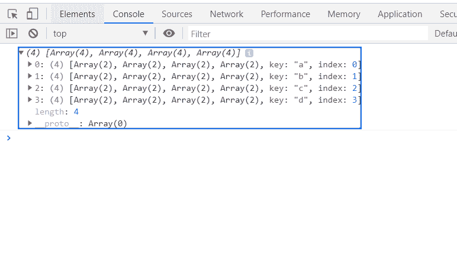
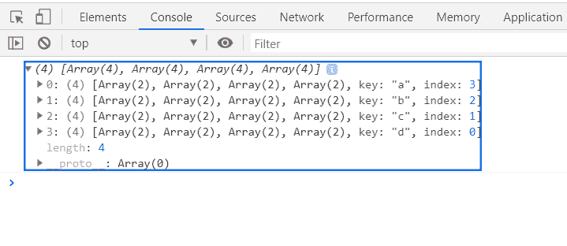

# D3.js stack.order()方法

> 原文:[https://www.geeksforgeeks.org/d3-js-stack-order-method/](https://www.geeksforgeeks.org/d3-js-stack-order-method/)

**stack . order()方法** t 使用一个排序函数作为参数，并返回堆栈生成器。

**语法:**

```
stack.order(orderingFunc)

```

**参数:**该函数接受如上所述的单个参数，如下所述:

*   **orderingFunc:** 这是一个对栈内容进行排序的函数。

**返回值:**此方法返回堆栈生成器。

**示例 1:** 使用 d3.stackOrderNone 函数对堆栈进行排序。

## 超文本标记语言

```
<!DOCTYPE html>
<html>
<head>
    <meta charset="utf-8">

    <script src=
        "https://d3js.org/d3.v5.min.js">
    </script>
</head>

<body>
    <h1 style="text-align: center; color: green;">
        GeeksforGeeks
    </h1>

    <center>
        <canvas id="gfg" width="200" height="200">
        </canvas>
    </center>

    <script>
        var data = [
              {letter: {a: 3840, b: 1920, c: 960, d: 400}},
              {letter: {a: 1600, b: 1440, c: 960, d: 400}},
              {letter: {a:  640, b:  960, c: 640, d: 400}},
              {letter: {a:  320, b:  480, c: 640, d: 400}}
            ];

        var stackGen = d3.stack()
            // Defining keys
            .keys(["a", "b", "c", "d"])
            // Ordering
            .order(d3.stackOrderNone);

        var stack = stackGen(data);

        console.log(stack);

    </script>
</body>

</html>
```

**输出:**



**示例 2:** 使用 d3.stackOrderReverse 函数对堆栈进行排序。

## 超文本标记语言

```
<!DOCTYPE html>
<html>
<head>
    <meta charset="utf-8">

    <script src=
        "https://d3js.org/d3.v5.min.js">
    </script>
</head>

<body>
    <h1 style="text-align: center; color: green;">
        GeeksforGeeks
    </h1>

    <center>
        <canvas id="gfg" width="200" height="200">
        </canvas>
    </center>

    <script>
        var data = [
              {letter: {a: 3840, b: 1920, c: 960, d: 400}},
              {letter: {a: 1600, b: 1440, c: 960, d: 400}},
              {letter: {a:  640, b:  960, c: 640, d: 400}},
              {letter: {a:  320, b:  480, c: 640, d: 400}}
            ];

        var stackGen = d3.stack()
            // Defining keys
            .keys(["a", "b", "c", "d"])
            // Ordering
            .order(d3.stackOrderReverse);

        var stack = stackGen(data);

        console.log(stack);

    </script>
</body>

</html>
```

**输出:**

