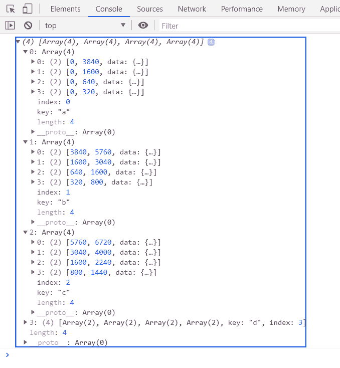

# D3.js stack.value()方法

> 原文:[https://www.geeksforgeeks.org/d3-js-stack-value-method/](https://www.geeksforgeeks.org/d3-js-stack-value-method/)

**stack . value()方法** t 使用一个返回与某个键相关联的值的函数。

**语法:**

```
stack.value([value_func])

```

**参数:**该函数接受如上所述的单个参数，如下所述:

*   **value_func:** 这是一个返回与键相关联的值的函数。

**返回值:**这个方法没有返回值。

**示例:**

## 超文本标记语言

```
<!DOCTYPE html>
<html>

<head>
    <meta charset="utf-8">
    <script src=
        "https://d3js.org/d3.v5.min.js">
    </script>
</head>

<body>
    <h1 style="text-align:center; color:green;">
        GeeksforGeeks
    </h1>

    <center>
        <canvas id="gfg" width="200" height="200">
        </canvas>
    </center>

    <script>
        var data = [
            { letter: { a: 3840, b: 1920, c: 960, d: 400 } },
            { letter: { a: 1600, b: 1440, c: 960, d: 400 } },
            { letter: { a: 640, b: 960, c: 640, d: 400 } },
            { letter: { a: 320, b: 480, c: 640, d: 400 } }
        ];

        var stackGen = d3.stack()
            // Defining keys
            .keys(["a", "b", "c", "d"])
            // Defining value function
            .value((obj, key) => obj.letter[key]);

        var stack = stackGen(data);

        console.log(stack);
    </script>
</body>

</html>
```

**输出:**

