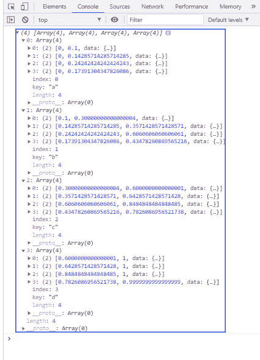

# D3 . js stackofsetexpand()方法

> 原文:[https://www . geeksforgeeks . org/D3-js-stack offsetexpand-method/](https://www.geeksforgeeks.org/d3-js-stackoffsetexpand-method/)

D3 . js**stackOrderOffsetExpand()**方法应用零基线，并对每个点的值进行标准化，使顶线始终为一。

**语法:**

```
d3.stackOrderOffsetExpand(series, order);

```

**参数:**该函数接受两个参数，如上所述，如下所述。

*   **系列:**这是展开偏移量所依据的系列。
*   **顺序:**这是栈的顺序。

**返回值:**此方法不返回值。

**示例:**

## 超文本标记语言

```
<!DOCTYPE html>
<html>
<head>
    <meta charset="utf-8">
    <script src=
        "https://d3js.org/d3.v5.min.js">
    </script>
</head>

<body>
    <h1 style="text-align: center; color: green;">
        GeeksforGeeks
    </h1>

    <script>
        var data = [
        {letter: {a: 1000, b: 2000, c: 3000, d: 4000}},
        {letter: {a: 2000, b: 3000, c: 4000, d: 5000}},
        {letter: {a: 640, b: 960, c: 640, d: 400}},
        {letter: {a: 320, b: 480, c: 640, d: 400}}
        ];
        var stack = d3.stack()
            .keys(["a", "b", "c", "d"])
            .value((d, key) => d.letter[key])
            .order(d3.stackOrderNone)

            // Use of d3.stackOrderOffsetExpand() Method
            .offset(d3.stackOffsetExpand);

        var series = stack(data);
        console.log(series);
    </script>
</body>
</html>
```

**输出:**

