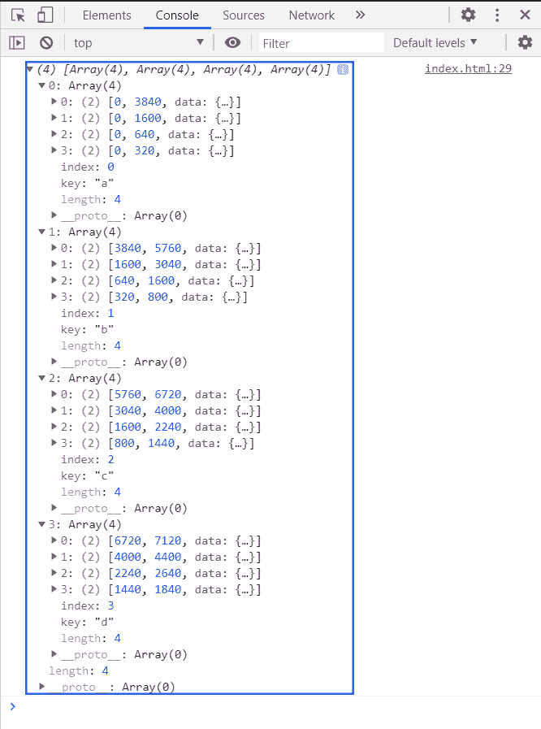

# D3.js stackOrderDescending()方法

> 原文:[https://www . geeksforgeeks . org/D3-js-stackorderdescending-method/](https://www.geeksforgeeks.org/d3-js-stackorderdescending-method/)

**D3 . stack . keys 降序()方法** o 根据stack . keys()方法定义的键顺序对序列进行排序。和最大的系列放在底部，向上升到最小。

**语法:**

```
d3.stackOrderDescending(series)

```

**参数:**该函数接受如上所述的单个参数，如下所述:

*   **系列:**这是基于要订购的钥匙的订购的系列。

**返回值:**此方法不返回值。

**示例:**使用 d3.stackOrderDescending 函数对堆栈进行排序。

## 超文本标记语言

```
<!DOCTYPE html>
<html>
<head>
    <meta charset="utf-8">

    <script src=
        "https://d3js.org/d3.v5.min.js">
    </script>
</head>

<body>
    <h1 style="text-align: center; color: green;">
        GeeksforGeeks
    </h1>

    <script>
        var data = [
          {a: 3840, b: 1920, c: 960, d: 400},
          {a: 1600, b: 1440, c: 960, d: 400},
          {a:  640, b:  960, c: 640, d: 400},
          {a:  320, b:  480, c: 640, d: 400}
        ];
        var stack = d3.stack()
            .keys(["a", "b", "c", "d"])
            .order(d3.stackOrderAscending)
            .offset(d3.stackOffsetNone);

        var series = stack(data);
        console.log(series);

    </script>
</body>

</html>
```

**输出:**

