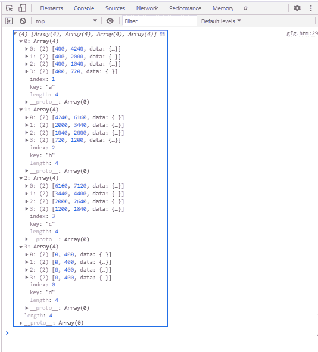

# D3.js stackOrderInsideOut()方法

> 原文:[https://www . geeksforgeeks . org/D3-js-stackorderinsideout-method/](https://www.geeksforgeeks.org/d3-js-stackorderinsideout-method/)

**D3 . js****stackOrderInsideOut()**方法返回一个序列顺序，使得较大的序列(根据值的总和)在内部，较小的序列在外部。

**语法:**

```
d3.stackOrderInsideOut(series);
```

**参数:**该函数接受一个参数，如上所述，如下所述。

*   **系列:**这是基于要排序的按键排序的系列。

**返回值:**此方法不返回值。

**示例:**以下示例演示了使用 **d3.stackOrderInsideOut()** 函数对堆栈进行排序。

## 超文本标记语言

```
<!DOCTYPE html>
<html>
<head>
    <meta charset="utf-8">
    <script src=
        "https://d3js.org/d3.v5.min.js">
    </script>
</head>

<body>
    <h1 style="text-align: center; color: green;">
        GeeksforGeeks
    </h1>

    <script>
        var data = [
        {letter: {a: 3840, b: 1920, c: 960, d: 400}},
        {letter: {a: 1600, b: 1440, c: 960, d: 400}},
        {letter: {a: 640, b: 960, c: 640, d: 400}},
        {letter: {a: 320, b: 480, c: 640, d: 400}}
        ];
        var stack = d3.stack()
            .keys(["a", "b", "c", "d"])
            .value((d, key) => d.letter[key])
            .order(d3.stackOrderInsideOut);

        var series = stack(data);
        console.log(series);
    </script>
</body>

</html>
```

**输出:**

