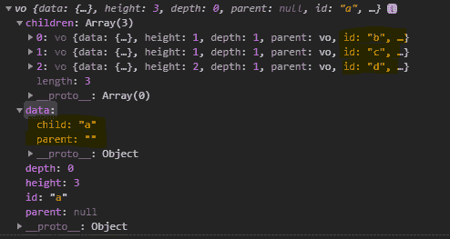
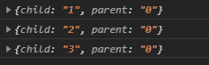

# D3.js 分层()功能

> 原文:[https://www.geeksforgeeks.org/d3-js-stratify-function/](https://www.geeksforgeeks.org/d3-js-stratify-function/)

**d3 .分层()**函数用于构造和返回一个新的分层运算符。该操作员有自己的默认设置。该函数用于将树形链接表示转换为层次结构。

**语法:**

```
d3.stratify();

```

**参数:**此功能不接受任何参数。

**返回值:**该函数返回一个函数。

下面是上面给出的函数的几个例子。

**例 1:**

## 超文本标记语言

```
<!DOCTYPE html> 
<html lang = "en"> 
<head> 
    <meta charset = "UTF-8" /> 
    <meta name = "viewport"
        path1tent = "width=device-width, 
        initial-scale = 1.0"/> 

    <script src =
        "https://d3js.org/d3.v4.min.js">
    </script>
</head> 

<body> 
    <script>
        // This is the data of the CSV file
        // child, parent
        // a,
        // b, a
        // c, a
        // d, a
        // e, b
        // f, c
        // g, c
        // h, d
        // i, h

        // Fetching the csv File
        d3.csv("./data.csv",(links)=>{
            var child = links.columns[0];
            var parent = links.columns[1];
            stratify = d3.stratify()
                        .id(d => d[child])
                        .parentId(d => d[parent]);
            var root=stratify(links)
            console.log(root)
        });
    </script> 
</body> 
</html>
```

**输出:**

[](https://media.geeksforgeeks.org/wp-content/uploads/20200824135100/01161.png)

**例 2:**

## 超文本标记语言

```
<!DOCTYPE html> 
<html lang = "en"> 
<head> 
    <meta charset = "UTF-8" /> 
    <meta name = "viewport"
        path1tent = "width=device-width, 
        initial-scale = 1.0"/> 
    <title>GeekforGeeks</title> 
    <script src =
    "https://d3js.org/d3.v4.min.js">
    </script>
</head> 

<body> 
    <script>
        // This is the data of the CSV file
        // child, parent
        // 0,
        // 1, 0
        // 2, 0
        // 3, 0
        // 4, 2
        // 5, 3

        // Fetching the csv File
        d3.csv("./data.csv",(links)=>{
            var child = links.columns[0];
            var parent = links.columns[1];
            stratify = d3.stratify()
                        .id(d => d[child])
                        .parentId(d => d[parent]);
            var root=stratify(links);
            console.log(root.children[0].data);
            console.log(root.children[1].data);
            console.log(root.children[2].data);
        });
    </script> 
</body> 
</html>
```

**输出:**

[](https://media.geeksforgeeks.org/wp-content/uploads/20200824135651/01162.png)