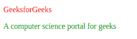
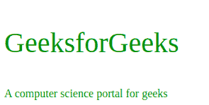

# D3.js style()功能

> 原文:[https://www.geeksforgeeks.org/d3-js-style-function/](https://www.geeksforgeeks.org/d3-js-style-function/)

D3.js 中的 **d3.style()** 函数用于为指定的节点(属性)设置指定名称(值)的样式。在这种情况下，如果节点具有指定名称的内联样式，则返回其值，如果节点没有内联样式，则返回计算值。

**语法:**

```
d3.style(node, name)

```

**参数:**该函数接受两个参数，如上所述，如下所述:

*   **节点:**这是所选元素的属性。
*   **名称:**指定属性的值。

**返回值:**该函数返回具有指定名称(值)的指定节点(属性)的值样式属性。

以下示例说明了 D3.js 中的 d3.style()函数
**示例 1:**

## 超文本标记语言

```
<!DOCTYPE html>
<html>
    <head>
        <title>
            D3.js | d3.style() Function
        </title>

        <script src=
"https://d3js.org/d3.v4.min.js">
        </script>
    </head>

    <body>
        <p style="color: green;">
          GeeksforGeeks
        </p>

        <p style="color: green;">
          A computer science portal for geeks
        </p>

        <script>

            // Calling the style() function
            d3.select("p").style("color", "red");
        </script>
    </body>
</html>
```

**输出:**



**例 2:**

## 超文本标记语言

```
<!DOCTYPE html>
<html>
    <head>
        <title>
            D3.js | d3.style() Function
        </title>

        <script src=
"https://d3js.org/d3.v4.min.js">
        </script>
    </head>

    <body>
        <p style="color: green;">
          GeeksforGeeks
        </p>

        <p style="color: green;">
          A computer science portal for geeks
        </p>

        <script>
            // Calling the style() function
            d3.select("p").style("font-size", "40px");
        </script>
    </body>
</html>
```

**输出:**

