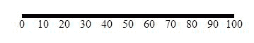

# D3.js svg.axis()功能

> 原文:[https://www.geeksforgeeks.org/d3-js-svg-axis-function/](https://www.geeksforgeeks.org/d3-js-svg-axis-function/)

D3.js 中的 **d3.svg.axis()函数**用于创建新的默认轴。该功能将在该轴上构造一个新的轴，可以执行各种操作。

**语法:**

```
d3.svg.axis()

```

**参数:**此功能不接受任何参数。

**返回值:**该函数返回创建的轴。

以下程序说明了 D3.js 中的 **d3.svg.axis()** 功能:

**例 1:**

## 超文本标记语言

```
<html>

<head>
    <title>
        D3.js | d3.axisLeft() Function
    </title>
    <script src="//d3js.org/d3.v3.min.js"></script>
</head>

<body>
    <script>
        var svg = d3.select("body").append("svg")
            .attr("width", 400)
            .attr("height", 400);

        // Create the Scale we will use
        // for the Axis
        var axisScale = d3.scale.linear()
            .domain([0, 100])
            .range([0, 300]);

        // Create the Axis
        var xAxis = d3.svg.axis()
            .scale(axisScale);

        // Create an SVG group Element for
        // the Axis elements and call the
        // xAxis function
        svg.append("g")
            .attr("transform", "translate(50, 50)")
            .call(xAxis);
    </script>
</body>

</html>
```

**输出:**



**例 2:**

## 超文本标记语言

```
<html>

<head>
    <title>
        D3.js | d3.axisLeft() Function
    </title>
    <script src="//d3js.org/d3.v3.min.js"></script>
</head>

<body>
    <script>
        var svg = d3.select("body").append("svg")
            .attr("width", 400)
            .attr("height", 400);

        // Create the Scale we will use for the Axis
        var axisScale = d3.scale.linear()
            .domain([0, 100])
            .range([300, 0]);

        // Create the Axis
        var xAxis = d3.svg.axis()
            .scale(axisScale);

        // Create an SVG group Element for the 
        // Axis elements and call the xAxis function
        svg.append("g")
            .attr("transform", "translate(50, 50)")
            .call(xAxis);
    </script>
</body>

</html>
```

**输出:**

