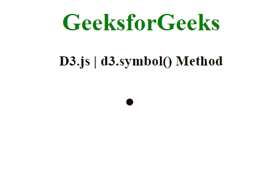

# D3.js 符号()方法

> 原文:[https://www.geeksforgeeks.org/d3-js-symbol-method/](https://www.geeksforgeeks.org/d3-js-symbol-method/)

**D3 . symbol()方法** c 用默认设置构建一个新的符号生成器。

**语法:**

```
d3.symbol()

```

**参数:**该函数不取任何参数。

**返回值:**该方法返回一个新符号生成器。

**示例:**

## 超文本标记语言

```
<!DOCTYPE html>
<html>
<head>
    <meta charset="utf-8">

    <script src=
        "https://d3js.org/d3.v5.min.js">
    </script>
</head>

<body>

    <h1 style="text-align: center; color: green;">
        GeeksforGeeks
    </h1>

    <h3 style="text-align: center;">
        D3.js | d3.symbol() Method
    </h3>

    <center>
    <svg id="gfg" width="80" height="100"></svg>
    </center>

    <script>

        d3.select("#gfg")
            .append("path")
            .attr("d", d3.symbol())
            .attr("transform", "translate(25,25)");

    </script>
</body>

</html>
```

**输出:**

