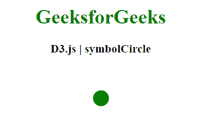
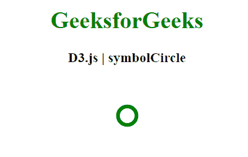

# D3.js 符号圆形属性

> 原文:[https://www . geesforgeks . org/D3-js-symbolcircle-property/](https://www.geeksforgeeks.org/d3-js-symbol-symbolcircle-property/)

**d3.symbolCircle** 是 D3.js 中的一个符号类型，是一个可以使用的普通圆，也是默认的符号类型。

**语法:**

```
d3.symbolCircle
```

**例 1:**

## 超文本标记语言

```
<!DOCTYPE html>
<html>
<head>
    <meta charset="utf-8">

    <script src=
        "https://d3js.org/d3.v5.min.js">
    </script>
</head>

<body>

    <h1 style="text-align: center; color: green;">
        GeeksforGeeks
    </h1>

    <h3 style="text-align: center;">
        D3.js | symbolCircle
    </h3>

    <center>
    <svg id="gfg" width="100" height="100"></svg>
    </center>

    <script>   

        // Circle Symbol
        var sym = d3.symbol()
            .type(d3.symbolCircle).size(500);
        d3.select("#gfg")
            .append("path")
            .attr("d", sym)
            .attr("fill", "green")
            .attr("transform", "translate(50,50)");
    </script>
</body>

</html>
```

**输出:**



**例 2:**

## 超文本标记语言

```
<!DOCTYPE html>
<html>
<head>
    <meta charset="utf-8">

    <script src=
        "https://d3js.org/d3.v5.min.js">
    </script>
</head>

<body>

    <h1 style="text-align:center; color:green;">
        GeeksforGeeks
    </h1>

    <h3 style="text-align: center;">
        D3.js | symbolCircle
    </h3>

    <center>
    <svg id="gfg" width="100" height="100"></svg>
    </center>

    <script>
        // Circle Symbol
        var sym = d3.symbol()
            .type(d3.symbolCircle).size(500);
        d3.select("#gfg")
            .append("path")
            .attr("d", sym)
            .attr("fill", "none")
            .attr("stroke","green")
            .attr("stroke-width","5px")
            .attr("transform", "translate(50,50)");
    </script>
</body>

</html>
```

**输出:**

