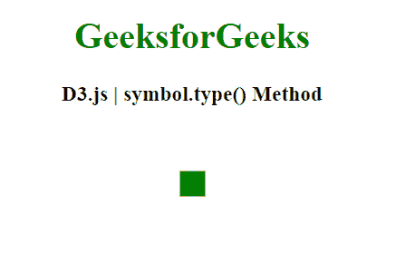
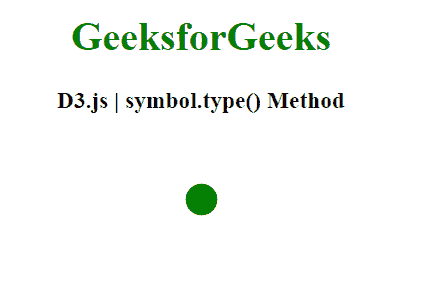

# D3.js 符号. type()方法

> 原文:[https://www.geeksforgeeks.org/d3-js-symbol-type-method/](https://www.geeksforgeeks.org/d3-js-symbol-type-method/)

**符号. type()方法** t 获取一个符号类型，设置它将生成的生成器符号。 默认的符号类型，如果没有设置，是 d3.symbolCircle 。

**语法:**

```
symbol.type([type])

```

**参数:**该函数接受如上所述的单个参数，如下所述:

*   **类型:**这是要设置的符号类型。

**返回值:**这个方法没有返回值。

**例 1:**

## 超文本标记语言

```
<!DOCTYPE html>
<html>
<head>
    <meta charset="utf-8">

    <script src=
        "https://d3js.org/d3.v5.min.js">
    </script>
</head>

<body>

    <h1 style="text-align:center; color:green;">
        GeeksforGeeks
    </h1>

    <h3 style="text-align: center;">
        D3.js | symbol.type() Method
    </h3>

    <center>
    <svg id="gfg" width="100" height="100"></svg>
    </center>

    <script>
        var sym = d3.symbol()
            .type(d3.symbolSquare).size(500);
        d3.select("#gfg")
            .append("path")
            .attr("d", sym)
            .attr("fill", "green")
            .attr("transform", "translate(50,50)");

    </script>
</body>

</html>
```

**输出:**



**例 2:**

## 超文本标记语言

```
<!DOCTYPE html>
<html>
<head>
    <meta charset="utf-8">

    <script src=
        "https://d3js.org/d3.v5.min.js">
    </script>
</head>

<body>
    <h1 style="text-align:center; color:green;">
        GeeksforGeeks
    </h1>

    <h3 style="text-align: center;">
        D3.js | symbol.type() Method
    </h3>

    <center>
    <svg id="gfg" width="100" height="100"></svg>
    </center>

    <script>
        var sym = d3.symbol()
            .type(d3.symbolCircle).size(500);
        d3.select("#gfg")
            .append("path")
            .attr("d", sym)
            .attr("fill", "green")
            .attr("transform", "translate(50,50)");
    </script>
</body>

</html>
```

**输出:**

