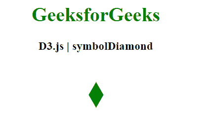
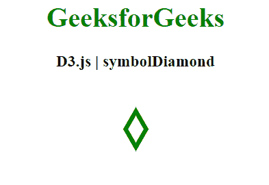

# D3.js 符号符号属性

> 原文:[https://www . geesforgeks . org/D3-js-symbol-symboldiamond-property/](https://www.geeksforgeeks.org/d3-js-symbols-symboldiamond-property/)

**d3.symbolDiamond** 属性是 D3.js 中的一个符号类型，是一个可以使用的钻石形符号类型。

**语法:**

```
d3.symbolDiamond
```

**例 1:**

## 超文本标记语言

```
<!DOCTYPE html>
<html>
<head>
    <meta charset="utf-8">

    <script src=
        "https://d3js.org/d3.v5.min.js">
    </script>
</head>

<body>
    <h1 style="text-align: center; color: green;">
        GeeksforGeeks
    </h1>

    <h3 style="text-align: center;">
        D3.js | symbolDiamond 
    </h3>

    <center>
        <svg id="gfg" width="100" height="100"></svg>
    </center>

    <script>
        // symbolDiamond
        var sym = d3.symbol()
            .type(d3.symbolDiamond).size(500);
        d3.select("#gfg")
            .append("path")
            .attr("d", sym)
            .attr("fill", "green")
            .attr("transform", "translate(50,50)");
    </script>
</body>

</html>
```

**输出:**



**例 2:**

## 超文本标记语言

```
<!DOCTYPE html>
 <html>

 <head>
     <meta charset="utf-8">

     <script src=
         "https://d3js.org/d3.v5.min.js">
     </script>
 </head>

 <body>

     <h1 style="text-align: center; color: green;">
         GeeksforGeeks
     </h1>

     <h3 style="text-align: center;">
         D3.js | symbolDiamond
     </h3>

     <center>
     <svg id="gfg" width="100" height="100"></svg>
     </center>

     <script>
         // symbolDiamond 
         var sym = d3.symbol()
             .type(d3.symbolDiamond).size(500);
         d3.select("#gfg")
             .append("path")
             .attr("d", sym)
             .attr("fill", "none")
             .attr("stroke","green")
             .attr("stroke-width","5px")
             .attr("transform", "translate(50,50)");
     </script>
 </body>

 </html>
```

**输出:**

