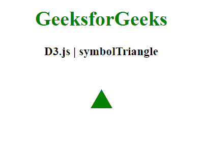
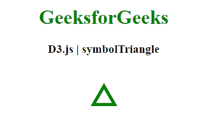

# D3.js 符号符号

> 哎哎哎::1230【https://www . geeksforgeeks . org/D3-js 符号三角符号/

**d3.symbolTriangle** 是 D3.js 中的符号类型，是可以使用的方形符号类型。

**语法:**

```html
d3.symbolTriangle 
```

**例 1:**

```html
<!DOCTYPE html>
<html>
<head>
    <meta charset="utf-8">

    <script src=
        "https://d3js.org/d3.v5.min.js">
    </script>
</head>

<body>

    <h1 style="text-align: center;
         color: green;">
        GeeksforGeeks
    </h1>

    <h3 style="text-align: center;">
        D3.js | symbolTriangle 
    </h3>

    <center>
    <svg id="gfg" width="100" 
         height="100"></svg>
    </center>

    <script>
        // symbolTriangle
        var sym = 
d3.symbol().type(d3.symbolTriangle).size(500);
        d3.select("#gfg")
            .append("path")
            .attr("d", sym)
            .attr("fill", "green")
            .attr("transform", "translate(50, 50)");

    </script>
</body>

</html>
```

**输出:**



**例 2:**

```html
<!DOCTYPE html>
    <html>
    <head>
        <meta charset="utf-8">

        <script src=
            "https://d3js.org/d3.v5.min.js">
        </script>
    </head>

    <body>

        <h1 style="text-align: center; 
            color: green;">
            GeeksforGeeks
        </h1>

        <h3 style="text-align: center;">
            D3.js | symbolTriangle
        </h3>

        <center>
        <svg id="gfg" width="100"
             height="100"></svg>
        </center>

        <script>
            // symbolTriangle 
            var sym = 
d3.symbol().type(d3.symbolTriangle).size(500);
            d3.select("#gfg")
                .append("path")
                .attr("d", sym)
                .attr("fill", "none")
                .attr("stroke", "green")
                .attr("stroke-width", "5px")
                .attr("transform", "translate(50, 50)");
        </script>
    </body>

    </html>
```

**输出:**

