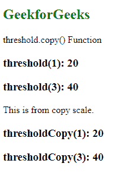
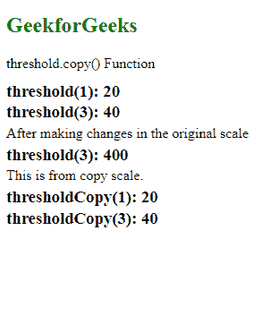

# D3.js threshold.copy()函数

> 原文:[https://www . geesforgeks . org/D3-js-threshold-copy-function/](https://www.geeksforgeeks.org/d3-js-threshold-copy-function/)

d3.js 中的 **threshold.copy()** 函数用于创建并返回阈值比例的精确副本。原始比例的任何变化都不会影响拷贝比例。

**语法:**

```
threshold.copy();
```

**参数:**此功能不接受任何参数。

**返回值:**该函数返回原始阈值比例的精确副本。

**例 1:**

## 超文本标记语言

```
<!DOCTYPE html>
<html lang="en">

<head>
    <meta charset="UTF-8" />
    <meta name="viewport" path1tent=
        "width=device-width,initial-scale=1.0" />

    <script src="https://d3js.org/d3.v4.min.js">
    </script>
</head>

<body>
    <h2 style="color:green">GeekforGeeks</h2>

    <p>threshold.copy() Function </p>

    <script>
        var threshold = d3.scaleThreshold()
            // Domain
            .domain([1, 2, 3, 4])
            // Range for the domain
            .range([10, 20, 30, 40, 50]);

        document.write("<h3>threshold(1): " 
            + threshold(1) + "</h3>");
        document.write("<h3>threshold(3): " 
            + threshold(3) + "</h3>");

        document.write(
            "<p> This is from copy scale.</p>");

        var thresholdCopy = threshold.copy();

        document.write("<h3>thresholdCopy(1): " 
            + thresholdCopy(1) + "</h3>");
        document.write("<h3>thresholdCopy(3): " 
            + thresholdCopy(3) + "</h3>");
    </script>
</body>

</html>
```

**输出:**



**例 2:**

## 超文本标记语言

```
<!DOCTYPE html>
<html lang="en">

<head>
    <meta charset="UTF-8" />
    <meta name="viewport" path1tent=
        "width=device-width,initial-scale=1.0" />

    <script src="https://d3js.org/d3.v4.min.js">
    </script>
</head>

<body>
    <h2 style="color:green">GeekforGeeks</h2>

    <p>threshold.copy() Function </p>

    <script>
        var threshold = d3.scaleThreshold()
            // Domain
            .domain([1, 2, 3, 4])
            // Range for the domain
            .range([10, 20, 30, 40, 50]);

        var thresholdCopy = threshold.copy();

        document.write(
            "<div style=line-height:5px><h3>threshold(1): " 
            + threshold(1) + "</h3>");

        document.write("<h3>threshold(3): " 
                + threshold(3) + "</h3>");

        // Making changes on the original scale
        threshold.range([100, 200, 300, 400, 500]);
        document.write(
        "<p> After making changes in the original scale</p>");

        document.write("<h3>threshold(3): " 
                + threshold(3) + "</h3>");

        document.write("<p> This is from copy scale.</p>");

        document.write("<h3>thresholdCopy(1): " 
                + thresholdCopy(1) + "</h3>");
        document.write("<h3>thresholdCopy(3): " 
                + thresholdCopy(3) + "</h3></div>");
    </script>
</body>

</html>
```

**输出:**

