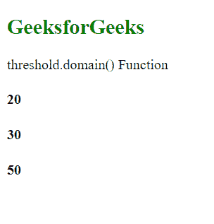
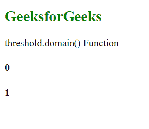

# D3.js threshold.domain()函数

> 原文:[https://www . geesforgeks . org/D3-js-threshold-domain-function/](https://www.geeksforgeeks.org/d3-js-threshold-domain-function/)

**阈值域()**功能用于设置阈值尺度的域。这里给出的值必须是非降序的，如果不是，那么标度的行为是未定义的。

**语法:**

```
threshold.domain([domain]);

```

**参数:**该函数接受一个参数，如上所述，如下所述。

*   **定义域:**此参数接受按排序顺序排列的元素数组，该数组设置刻度的定义域。

**返回值:**该函数不返回值。

下面的程序说明了 **D3.js** 中的 **threshold.domain()** 功能

**例 1:**

## 超文本标记语言

```
<!DOCTYPE html>
<html lang="en">

<head>
    <meta charset="UTF-8" />
    <meta name="viewport" path1tent=
        "width=device-width,initial-scale=1.0" />

    <script src="https://d3js.org/d3.v4.min.js">
    </script>
</head>

<body>
    <h2 style="color: green;">GeeksforGeeks</h2>

    <p>threshold.domain() Function</p>

    <script>
        var threshold = d3.scaleThreshold()

            // Setting domain for the scale.
            .domain([1, 2, 3, 4])
            .range([10, 20, 30, 40, 50]);
        let val1 = threshold(1);
        let val2 = threshold(2);
        let val3 = threshold(4);
        document.write("<h4>" + val1 + "</h4>");
        document.write("<h4>" + val2 + "</h4>");
        document.write("<h4>" + val3 + "</h4>");
    </script>
</body>

</html>
```

**输出:**



**例 2:**

## 超文本标记语言

```
<!DOCTYPE html>
<html lang="en">

<head>
    <meta charset="UTF-8" />
    <meta name="viewport" path1tent=
        "width=device-width, initial-scale=1.0" />

    <script src="https://d3js.org/d3.v4.min.js">
    </script>
</head>

<body>
    <h2 style="color: green;">GeeksforGeeks</h2>

    <p>threshold.domain() Function </p>

    <script>
        var threshold = d3.scaleThreshold()

            // Setting domain for the scale.
            .domain([1, 2, 3, 4]);
        document.write("<h4>" + threshold(0) + "</h4>");
        document.write("<h4>" + threshold(4) + "</h4>");
    </script>
</body>

</html>
```

**输出:**

