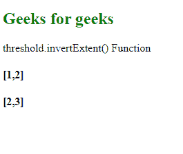
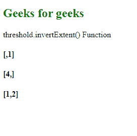

# D3.js 阈值.反转范围()函数

> 原文:[https://www . geesforgeks . org/D3-js-threshold-invert extend-function/](https://www.geeksforgeeks.org/d3-js-threshold-invertextent-function/)

d3.js 中的**threshold . invertextend()**函数用于返回指定域中值的范围。

**语法:**

```
threshold.invertExtent(value);
```

**参数:**该函数接受一个参数，如上所述，如下所述:

*   **值:**该参数取给定范围内的值。

**返回值:**该函数从对应于给定输入值的域中返回一个值。

下面是上面给出的函数的几个例子。

**例 1:**

```
<!DOCTYPE html> 
<html lang="en"> 
<head> 
    <meta charset="UTF-8" /> 
    <meta name="viewport"
        path1tent="width=device-width, 
        initial-scale=1.0"/> 
    <script src=
    "https://d3js.org/d3.v4.min.js">
    </script> 
    <script src=
    "https://d3js.org/d3-color.v1.min.js">
    </script> 
    <script src=
    "https://d3js.org/d3-interpolate.v1.min.js">
    </script> 
    <script src=
    "https://d3js.org/d3-scale-chromatic.v1.min.js">
    </script> 
</head> 
<body> 
    <h2 style="color:green;">Geeks for geeks</h2>
    <p>threshold.invertExtent() Function </p>
    <script> 
        var threshold = d3.scaleThreshold()
                    // Setting domain for the scale.
                    .domain([1, 2, 3, 4])
                    .range(["red", "green", "blue"]);
        let val1=threshold.invertExtent("green");
        let val2=threshold.invertExtent("blue");
        document.write("<h4>["+val1+"]</h4>");
        document.write("<h4>["+val2+"]</h4>");
    </script> 
</body> 
</html>
```

**输出:**

[](https://media.geeksforgeeks.org/wp-content/uploads/20200819232305/0178.png)

**例 2:**

```
<!DOCTYPE html> 
<html lang="en"> 
<head> 
    <meta charset="UTF-8" /> 
    <meta name="viewport"
        path1tent="width=device-width, 
        initial-scale=1.0"/> 
    <script src=
    "https://d3js.org/d3.v4.min.js">
    </script> 
    <script src=
    "https://d3js.org/d3-color.v1.min.js">
    </script> 
    <script src=
    "https://d3js.org/d3-interpolate.v1.min.js">
    </script> 
    <script src=
    "https://d3js.org/d3-scale-chromatic.v1.min.js">
    </script> 
</head> 
<body> 
    <h2 style="color:green;">Geeks for geeks</h2>
    <p>threshold.invertExtent() Function </p>
    <script> 
        var threshold = d3.scaleThreshold()
                    // Setting domain for the scale.
                    .domain([1, 2, 3, 4])
                    .range([10, 20, 30, 40, 50]);
        let val1=threshold.invertExtent(10);
        let val2=threshold.invertExtent(50);
        let val3=threshold.invertExtent(20);
        document.write("<h4>["+val1+"]</h4>");
        document.write("<h4>["+val2+"]</h4>");
        document.write("<h4>["+val3+"]</h4>");
    </script> 
</body> 
</html>
```

**输出:**

[](https://media.geeksforgeeks.org/wp-content/uploads/20200819232515/0179.png)