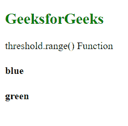
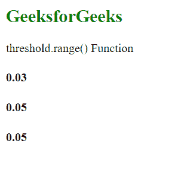

# D3.js 阈值.范围()函数

> 原文:[https://www . geesforgeks . org/D3-js-threshold-range-function/](https://www.geeksforgeeks.org/d3-js-threshold-range-function/)

**阈值范围()**功能用于设置阈值范围。范围数组中的值的数量总是比域数组大一个，如果不是，则标度的行为可能是未定义的。

**语法:**

```
threshold.range([range]);
```

**参数:**该功能接受上面给出的和下面描述的单个参数。

*   **范围:**该参数接受离散值数组。如果域中有“n”个值，则范围必须有“n+1”个值。

**返回值:**该函数不返回值。

**例 1:**

## 超文本标记语言

```
<!DOCTYPE html>
<html lang="en">

<head>
    <meta charset="UTF-8" />
    <meta name="viewport" path1tent=
        "width=device-width,initial-scale=1.0" />

    <script src="https://d3js.org/d3.v4.min.js">
    </script>
</head>

<body>
    <h2 style="color:green;">GeeksforGeeks</h2>

    <p>threshold.range() Function </p>

    <script>
        var threshold = d3.scaleThreshold()

            // Setting domain for the scale.
            .domain([10, 20, 30, 40])

            // Setting the range for the scale.
            // Number of elements is one more 
            // then domain array size.
            .range(["red", "blue", 
                "green", "yellow", "white"]);

        document.write("<h4>" 
            + threshold(10) + "</h4>");

        document.write("<h4>" 
            + threshold(20) + "</h4>");
    </script>
</body>

</html>
```

**输出:**



**例 2:**

## 超文本标记语言

```
<!DOCTYPE html>
<html lang="en">

<head>
    <meta charset="UTF-8" />
    <meta name="viewport" path1tent=
        "width=device-width,initial-scale=1.0" />

    <script src="https://d3js.org/d3.v4.min.js">
    </script>
</head>

<body>
    <h2 style="color:green;">GeeksforGeeks</h2>

    <p>threshold.range() Function </p>

    <script>
        var threshold = d3.scaleThreshold()

            // Setting domain for the scale.
            .domain([10, 20, 30, 40])

            // Setting the range for the scale.
            // Number of elements is one more 
            // then domain array size.
            .range([0.01, 0.02, 0.03, 0.04, 0.05]);

        document.write("<h4>" 
            + threshold(20) + "</h4>"); // 0.03

        document.write("<h4>" 
            + threshold(40) + "</h4>"); // 0.05

        // This value is outside the domain
        document.write("<h4>" 
            + threshold(500) + "</h4>"); // 0.05
    </script>
</body>

</html>
```

**输出:**

