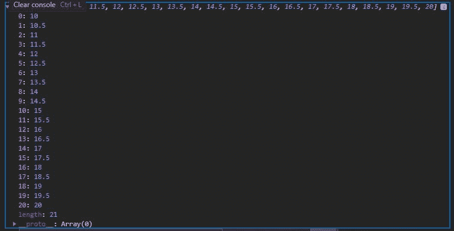
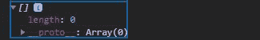

# D3.js ticks()函数

> Original: [https://www.geeksforgeeks.org/d3-js-ticks-function/](https://www.geeksforgeeks.org/d3-js-ticks-function/)

D3.js 中的 **ticks()** 函数用于在给定的开始和停止范围(包括开始和停止)之间形成一个数组，这样每个元素都是均匀等间距的。

**语法:**

```
d3.ticks(start,stop,count);

```

**参数:** 该功能接受三个参数，如上所述，描述如下:

*   **start:** 是我们希望数组元素所在位置的起始值，是包含的。
*   **stop:** 是我们希望数组元素达到的起始值，是包含的。
*   **计数:**是给定起止范围内我们想要的元素数量。

**返回值:**它返回一组精确舍入的数字。

下面给出了 ticks()函数的几个例子。

**例 1:**

## 超文本标记语言

```
<!DOCTYPE html>
<html lang="en">
<head>
  <meta charset="UTF-8">
  <meta name="viewport" 
        content="width=device-width, initial-scale=1.0">
  <title>Document</title>
</head>
<body>
  <!--fetching from CDN of D3.js -->
  <script type = "text/javascript" 
          src = "https://d3js.org/d3.v4.min.js">
  </script>
  <script>
    // Choosing 10 elements in a range
    // Note that each element is equally spaced
    console.log(d3.ticks(10, 20, 20))
  </script>
</body>
</html>
```

**输出:**



**例 2:**

## 超文本标记语言

```
<!DOCTYPE html>
<html lang="en">
<head>
  <meta charset="UTF-8">
  <meta name="viewport" 
        content="width=device-width, initial-scale=1.0">
  <title>Document</title>
</head>
<body>
  <!--fetching from CDN of D3.js -->
  <script type = "text/javascript" 
          src = "https://d3js.org/d3.v4.min.js">
  </script>
  <script>
    // Choosing 10 elements in a range
    console.log(d3.ticks(10, 20))
  </script>
</body>
</html>
```

**输出:**

