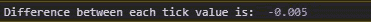

# D3.js tickStep()功能

> 原文:[https://www.geeksforgeeks.org/d3-js-tickstep-function/](https://www.geeksforgeeks.org/d3-js-tickstep-function/)

D3.js 中的 **tickStep()** 函数用于返回数组中相邻 tick 值之间的差值。

**语法:**

```
tickStep(start,stop,count);

```

**参数:**该功能接受三个参数，如上所述，描述如下:

*   **start:** 是我们希望数组元素所在位置的起始值，是包含的。
*   **stop:** 是我们希望数组元素达到的起始值，是包含的。
*   **计数:**是给定起止范围内我们想要的元素数量。

**返回值:**以浮点表示形式返回该步长值。

下面给出了 ticks()函数的几个例子

**例 1:**

## 超文本标记语言

```
<!DOCTYPE html>
<html lang="en">
<head>
  <meta charset="UTF-8">
  <meta name="viewport" 
        content="width=device-width, initial-scale=1.0">
  <title>D3 tickStep() Function</title>
</head>
<body>
  <!--fetching from CDN of D3.js -->
  <script type = "text/javascript" 
          src = "https://d3js.org/d3.v4.min.js">
  </script>
  <script>
    // Choosing 10 elements in a range
    let step=d3.tickStep(10, 20, 10);
    console.log("Difference between each tick value is: ",step);

  </script>
</body>
</html>
```

**输出:**


**例 2:**

## 超文本标记语言

```
<!DOCTYPE html>
<html lang="en">
<head>
  <meta charset="UTF-8">
  <meta name="viewport" 
        content="width=device-width, initial-scale=1.0">
  <title>Document</title>
</head>
<body>
  <!--fetching from CDN of D3.js -->
  <script type = "text/javascript" 
          src = "https://d3js.org/d3.v4.min.js">
  </script>
  <script>
    // Choosing 1000 elements in a range
    let step=d3.tickStep(10, 15, 1000);
    console.log("Difference between"+
                " each tick value is: ",step);

  </script>
</body>
</html>
```

**输出:**


**例 3:** 如果停止次数少于开始次数

## 超文本标记语言

```
<!DOCTYPE html>
<html lang="en">
<head>
  <meta charset="UTF-8">
  <meta name="viewport" 
        content="width=device-width, initial-scale=1.0">
  <title>Document</title>
</head>
<body>
  <!--fetching from CDN of D3.js -->
  <script type = "text/javascript" 
          src = "https://d3js.org/d3.v4.min.js">
  </script>
  <script>
    // Choosing 1000 elements in a range
    let step=d3.tickStep(10, 5, 1000);
    console.log("Difference between"+
                " each tick value is: ",step);

  </script>
</body>
</html>
```

**输出:**

