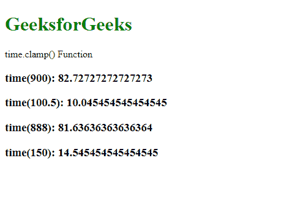
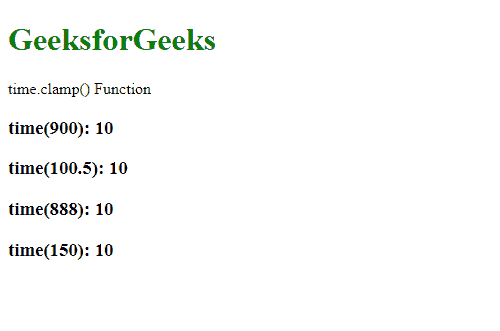

# D3 . js . time . clamp()功能

> 原文:[https://www.geeksforgeeks.org/d3-js-time-clamp-function/](https://www.geeksforgeeks.org/d3-js-time-clamp-function/)

**D3.js** 中的**时间夹钳()**功能用于启用或禁用夹钳。如果箝位被禁用，则返回值的范围可能超出给定范围。

**语法:**

```
time.clamp( clamp )
```

**参数:**该函数只接受一个参数，如上所述，如下所述:

*   **箝位:**是一个布尔值，定义箝位是启用还是禁用。

**返回值:**这个函数不返回任何东西。

以下程序说明了 D3.js 中的**时间箝位()**功能:

**例 1:** 当夹钳设置为假时。

## 超文本标记语言

```
<!DOCTYPE html>
<html>

<head>
    <script src="https://d3js.org/d3.v4.min.js">
    </script>
    <script src=
        "https://d3js.org/d3-color.v1.min.js">
    </script>
    <script src=
    "https://d3js.org/d3-interpolate.v1.min.js">
    </script>
    <script src=
    "https://d3js.org/d3-scale-chromatic.v1.min.js">
    </script>
</head>

<body>
    <h1 style="color: green">GeeksforGeeks</h1>

    <p>time.clamp() Function </p>

    <script>

        var time = d3.scaleTime()
            // Setting domain for the scale.
            .domain([1, 100])
            .range([1, 10])
            .clamp(false);

        document.write("<h3>time(900): " +
            time(900) + "</h3>");
        document.write("<h3>time(100.5): " +
            time(100.5) + "</h3>");
        document.write("<h3>time(888): " +
            time(888) + "</h3>");
        document.write("<h3>time(150): " +
            time(150) + "</h3>");
    </script>
</body>

</html>
```

**输出:**



**示例 2:** 当箝位设置为真时。

## 超文本标记语言

```
<!DOCTYPE html>
<html>

<head>
    <script src="https://d3js.org/d3.v4.min.js">
    </script>
    <script src=
        "https://d3js.org/d3-color.v1.min.js">
    </script>
    <script src=
    "https://d3js.org/d3-interpolate.v1.min.js">
    </script>
    <script src=
    "https://d3js.org/d3-scale-chromatic.v1.min.js">
    </script>
</head>

<body>
    <h1 style="color: green">GeeksforGeeks</h1>

    <p>time.clamp() Function </p>

    <script>

        var time = d3.scaleTime()
            // Setting domain for the scale.
            .domain([1, 100])
            .range([1, 10])
            .clamp(true);

        document.write("<h3>time(900): "
            + time(900) + "</h3>");
        document.write("<h3>time(100.5): "
            + time(100.5) + "</h3>");
        document.write("<h3>time(888): "
            + time(888) + "</h3>");
        document.write("<h3>time(150): "
            + time(150) + "</h3>");
    </script>
</body>

</html>
```

**输出:**

