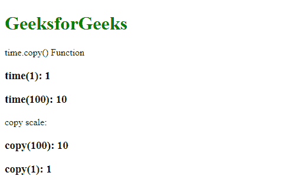
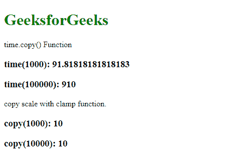

# D3.js time.copy()功能

> 原文:[https://www.geeksforgeeks.org/d3-js-time-copy-function/](https://www.geeksforgeeks.org/d3-js-time-copy-function/)

**D3.js** 中的 **time.copy()** 功能用于构造并返回原始比例的副本。对原始比例所做的更改不会影响拷贝比例，反之亦然。

**语法:**

```
time.copy()
```

**参数:**此功能不接受任何参数。

**返回值:**该函数返回原始刻度的副本。

以下程序说明了 D3.js 中的 **time.copy()** 功能:

**例 1:**

## 超文本标记语言

```
<!DOCTYPE html>
<html>

<head>
    <script src="https://d3js.org/d3.v4.min.js">
    </script>
    <script src="https://d3js.org/d3-color.v1.min.js">
    </script>
    <script src=
    "https://d3js.org/d3-interpolate.v1.min.js">
    </script>
    <script src=
    "https://d3js.org/d3-scale-chromatic.v1.min.js">
    </script>
</head>

<body>
    <h1 style="color: green;">GeeksforGeeks</h1>

    <p>time.copy() Function </p>

    <script>

        var time = d3.scaleTime()

            // Setting domain and range
            // for the scale
            .domain([1, 100])
            .range([1, 10]);

        // Creating a copy of the scale
        var copy = time.copy();

        document.write("<h3>time(1): " +
            time(1) + "</h3>");
        document.write("<h3>time(100): " +
            time(100) + "</h3>");
        document.write("<p> copy scale: </p>");

    document.write("<h3>copy(100): " +
            copy(100) + "</h3>");
        document.write("<h3>copy(1): " +
            copy(1) + "</h3>");
    </script>
</body>

</html>
```

**输出:**



**例 2:**

## 超文本标记语言

```
<!DOCTYPE html>
<html>

<head>
    <script src="https://d3js.org/d3.v4.min.js">
    </script>
    <script src="https://d3js.org/d3-color.v1.min.js">
    </script>
    <script src=
    "https://d3js.org/d3-interpolate.v1.min.js">
    </script>
    <script src=
    "https://d3js.org/d3-scale-chromatic.v1.min.js">
    </script>
</head>

<body>
    <h1 style="color: green;">GeeksforGeeks</h1>

    <p>time.copy() Function </p>

    <script>

        var time = d3.scaleTime()

            // Setting domain and range
            // for the scale.
            .domain([1, 100])
            .range([1, 10]);

        // Creating a copy of the scale
        var copy = time.copy();

        document.write("<h3>time(1000): " +
            time(1000) + "</h3>");
        document.write("<h3>time(100000): " +
            time(10000) + "</h3>");

        // Using clamp on the copy of the scale
        document.write(
    "<p> copy scale with clamp function.</p>");

        copy.clamp(true);
        document.write("<h3>copy(1000): " +
            copy(1000) + "</h3>");
        document.write("<h3>copy(10000): " +
            copy(10000) + "</h3>");
    </script>
</body>

</html>
```

**输出:**

