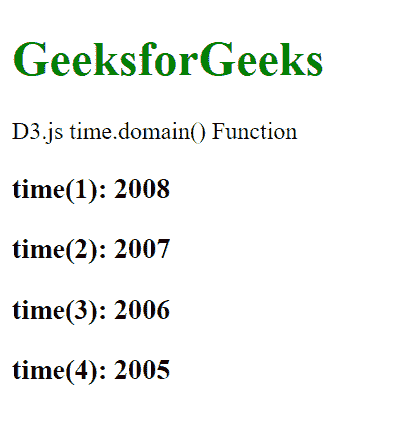
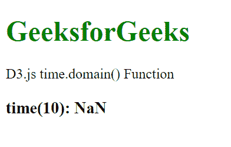

# D3.js 时域()函数

> 原文:[https://www.geeksforgeeks.org/d3-js-time-domain-function/](https://www.geeksforgeeks.org/d3-js-time-domain-function/)

**d3.js** 中的**时域()**功能用于设置时间刻度的域。如果未指定域，则默认域为[2000-01-01，2000-01-02]。

**语法:**

```
time.domain([domain]);
```

**参数:**该函数接受一个上面给定的参数，如下所述。

*   **域:**这个取一个数组的数。默认值为[2000-01-01，2000-01-02]。

**返回值:**这个函数不返回任何东西。

**例 1:**

## 超文本标记语言

```
<!DOCTYPE html>
<html lang="en">

<head>
    <meta charset="UTF-8" />
    <meta name="viewport" path1tent="width=device-width, 
        initial-scale=1.0" />
    <title>Geeks for geeks</title>
    <script src="https://d3js.org/d3.v4.min.js">
    </script>
    <script src="https://d3js.org/d3-color.v1.min.js">
    </script>
    <script src="https://d3js.org/d3-interpolate.v1.min.js">
    </script>
    <script src="https://d3js.org/d3-scale-chromatic.v1.min.js">
    </script>
</head>

<body>
    <h1 style="color:green;">
        GeeksforGeeks
    </h1>

    <p>D3.js time.domain() Function </p>

    <script>
        var time = d3.scaleTime()

            // Setting domain for the scale
            .domain([2011 - 01 - 01, 2015 - 05 - 02]);

        document.write("<h3>time(1): " + time(1) + "</h3>");
        document.write("<h3>time(2): " + time(2) + "</h3>");
        document.write("<h3>time(3): " + time(3) + "</h3>");
        document.write("<h3>time(4): " + time(4) + "</h3>");
    </script>
</body>

</html>
```

**输出:**



**示例 2:** 以下示例演示了当域是字符串类型时的上述函数。

## 超文本标记语言

```
<!DOCTYPE html>
<html lang="en">

<head>
    <meta charset="UTF-8" />
    <meta name="viewport" path1tent="width=device-width, 
        initial-scale=1.0" />
    <script src="https://d3js.org/d3.v4.min.js">
    </script>
    <script src="https://d3js.org/d3-color.v1.min.js">
    </script>
    <script src="https://d3js.org/d3-interpolate.v1.min.js">
    </script>
    <script src="https://d3js.org/d3-scale-chromatic.v1.min.js">
    </script>
</head>

<body>
    <h1 style="color:green;">
        GeeksforGeeks
    </h1>

    <p>D3.js time.domain() Function </p>

    <script>
        // Setting domain for the scale 
        var time = d3.scaleTime()
            .domain(["2011-01-01", "2015-05-02"]);

        document.write("<h3>time(10): " 
                    + time(10) + "</h3>");
    </script>
</body>

</html>
```

**输出:**



**例 3:**

## 超文本标记语言

```
<!DOCTYPE html>
<html lang="en">

<head>
    <meta charset="UTF-8" />
    <meta name="viewport" path1tent="width=device-width, 
        initial-scale=1.0" />
    <script src="https://d3js.org/d3.v4.min.js">
    </script>
    <script src="https://d3js.org/d3-color.v1.min.js">
    </script>
    <script src="https://d3js.org/d3-interpolate.v1.min.js">
    </script>
    <script src="https://d3js.org/d3-scale-chromatic.v1.min.js">
    </script>
</head>

<body>
    <h1 style="color:green;">
        GeeksforGeeks
    </h1>

    <p>D3.js time.domain() Function </p>

    <script>
        // Setting domain for the scale 
        var time = d3.scaleTime()
            .domain([1, 100])
        // default range is used.
        document.write("<h3>time(1): " + time(1) + "</h3>");
        document.write("<h3>time(2): " + time(2) + "</h3>");
        document.write("<h3>time(3): " + time(3) + "</h3>");
        document.write("<h3>time(4): " + time(4) + "</h3>");
    </script>
</body>

</html>
```

**输出:**

