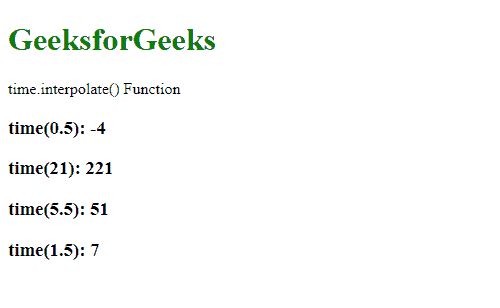
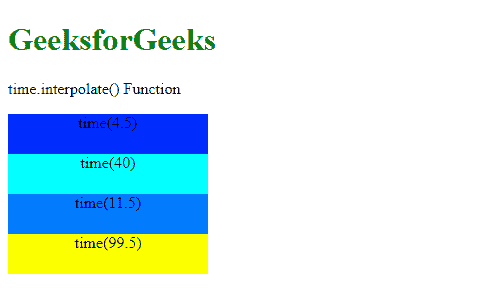

# D3 . js . time . INTERPOL()函数

> 原文:[https://www . geesforgeks . org/D3-js-time-INTERPOL-function/](https://www.geeksforgeeks.org/d3-js-time-interpolate-function/)

**D3.js** 中的**time . interpole()**功能用于更改标尺的范围插值器工厂。如果未指定工厂，则返回当前插值器。

**语法:**

```
time.interpolate( interpolate )
```

**参数:**该函数接受如上所述的单个参数，如下所述:

*   **插值:**该参数取插值函数。

以下程序说明了 D3.js 中的**time . interpole()**函数:

**例 1:**

## 超文本标记语言

```
<!DOCTYPE html>
<html>

<head>
    <script src="https://d3js.org/d3.v4.min.js">
    </script>
    <script src="https://d3js.org/d3-color.v1.min.js">
    </script>
    <script src=
    "https://d3js.org/d3-interpolate.v1.min.js">
    </script>
    <script src=
    "https://d3js.org/d3-scale-chromatic.v1.min.js">
    </script>
</head>

<body>
    <h1 style="color: green">
        GeeksforGeeks
    </h1>

    <p>time.interpolate() Function </p>

    <script>
        var time = d3.scaleTime()

            // Setting domain and range
            // for the scale
            .domain([1, 10])
            .range([1, 100])

            // Using the specified interpolation
            .interpolate(d3.interpolateRound);

        document.write("<h3>time(0.5): " +
            time(0.5) + "</h3>");
        document.write("<h3>time(21): " +
            time(21) + "</h3>");
        document.write("<h3>time(5.5): " +
            time(5.5) + "</h3>");
        document.write("<h3>time(1.5): " +
            time(1.5) + "</h3>");
    </script>
</body>

</html>
```

**输出:**



**例 2:**

## 超文本标记语言

```
<!DOCTYPE html>
<html>

<head>
    <script src="https://d3js.org/d3.v4.min.js">
    </script>
    <script src="https://d3js.org/d3-color.v1.min.js">
    </script>
    <script src=
    "https://d3js.org/d3-interpolate.v1.min.js">
    </script>
    <script src=
    "https://d3js.org/d3-scale-chromatic.v1.min.js">
    </script>

    <style>
        div {
            width: 200px;
            height: 40px;
            text-align: center;
            background-color: rgb(100, 150, 200);
        }
    </style>
</head>

<body>
    <h1 style="color: green">
        GeeksforGeeks
    </h1>

    <p>time.interpolate() Function </p>

    <div class="b1">time(4.5)</div>
    <div class="b2">time(40)</div>
    <div class="b3">time(11.5)</div>
    <div class="b4">time(99.5)</div>
    <script>
        var time = d3.scaleTime()

            // Setting domain and range
            // for the scale
            .domain([0, 100])
            .range(["blue", "yellow", "green"])

            // Using the specified interpolation
            .interpolate(
                d3.interpolateCubehelix.gamma(0.5)
            );

        var color1 = time(4.5);
        var color2 = time(40);
        var color3 = time(11.5);
        var color4 = time(99.5);
        var div1 = document.querySelector(".b1")
            .style.backgroundColor = color1;
        var div2 = document.querySelector(".b2")
            .style.backgroundColor = color2;
        var div3 = document.querySelector(".b3")
            .style.backgroundColor = color3;
        var div4 = document.querySelector(".b4")
            .style.backgroundColor = color4;
    </script>
</body>

</html>
```

**输出:**

