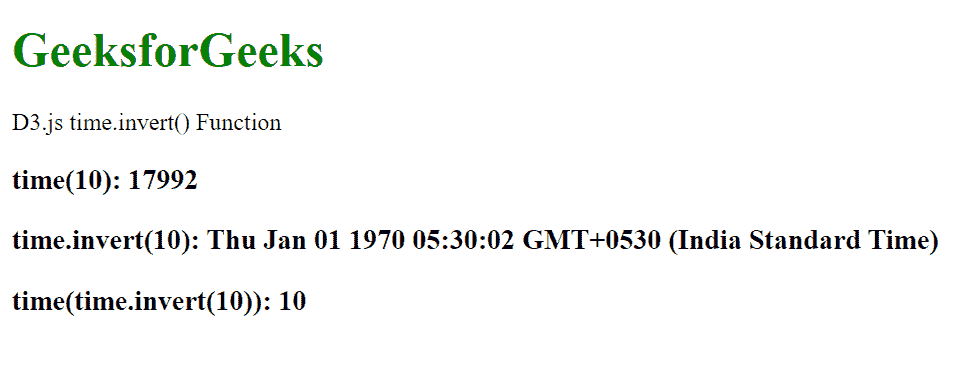
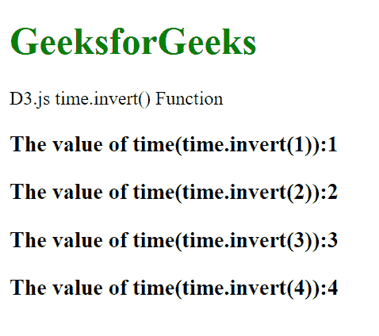

# D3.js time.invert()函数

> 原文:[https://www.geeksforgeeks.org/d3-js-time-invert-function/](https://www.geeksforgeeks.org/d3-js-time-invert-function/)

当给定指定范围的输入值时， **time.invert()** 函数用于从域中返回一个值。这种倒置在确定对应于鼠标位置的数据值时可能是有用的。

**语法:**

```
time.invert(value)
```

**参数:**该函数只接受一个如上所述的参数。

*   **值:**该参数接受指定范围内的值。

**返回值:**这个函数从指定的域中返回一个值。

**例 1:**

## 超文本标记语言

```
<!DOCTYPE html>
<html lang="en">

<head>
    <meta charset="UTF-8" />
    <meta name="viewport" path1tent="width=device-width, 
        initial-scale=1.0" />

    <script src="https://d3js.org/d3.v4.min.js">
    </script>
    <script src="https://d3js.org/d3-color.v1.min.js">
    </script>
    <script src=
    "https://d3js.org/d3-interpolate.v1.min.js">
    </script>
    <script src=
    "https://d3js.org/d3-scale-chromatic.v1.min.js">
    </script>
</head>

<body>
    <h1 style="color:green;">
        GeeksforGeeks
    </h1>

    <p>D3.js time.invert() Function</p>

    <script>
        var time = d3.scaleTime()
            .domain([2011 - 01 - 01, 2015 - 05 - 02])
            .range([1, 10])

        document.write("<h3>time(10): " 
                    + time(10) + "</h3>")

        document.write("<h3>time.invert(10): " 
                    + time.invert(10) + "</h3>")

        document.write("<h3>time(time.invert(10)): " 
                + time(time.invert(10)) + "</h3>")
    </script>
</body>

</html>
```

**输出:**



**例 2:**

## 超文本标记语言

```
<!DOCTYPE html>
<html lang="en">

<head>
    <meta charset="UTF-8" />
    <meta name="viewport" path1tent="width=device-width, 
        initial-scale=1.0" />
    <script src="https://d3js.org/d3.v4.min.js">
    </script>
    <script src="https://d3js.org/d3-color.v1.min.js">
    </script>
    <script src="https://d3js.org/d3-interpolate.v1.min.js">
    </script>
    <script src="https://d3js.org/d3-scale-chromatic.v1.min.js">
    </script>
</head>

<body>
    <h1 style="color:green;">
        GeeksforGeeks
    </h1>

    <p>D3.js time.invert() Function </p>

    <script>
        var time = d3.scaleTime()
            .domain([1, 100])
            .range([1, 10])

        document.write("<h3>The value of time(time.invert(1)):"
            + time(time.invert(1)) + "</h3>")
        document.write("<h3>The value of time(time.invert(2)):"
            + time(time.invert(2)) + "</h3> ")
        document.write("<h3>The value of time(time.invert(3)):"
            + time(time.invert(3)) + "</h3> ")
        document.write("<h3>The value of time(time.invert(4)):"
            + time(time.invert(4)) + "</h3> ")
    </script>
</body>

</html>
```

**输出:**

