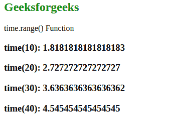
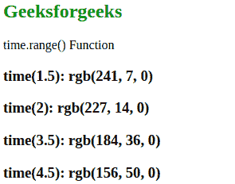

# D3.js 时间范围()功能

> 原文:[https://www.geeksforgeeks.org/d3-js-time-range-function/](https://www.geeksforgeeks.org/d3-js-time-range-function/)

**time.range()** 功能用于将刻度范围设置为指定的数值数组。给定的数组包含两个或多个元素。

**语法:**

```
time.range([range]);
```

**参数:**该功能接受如上所述的单个参数，描述如下:

*   **范围:**此参数接受数字或字符串数组。

**返回值:**这个函数不返回任何东西。

下面的例子说明了 D3.js 中的 time.range()函数:

**例 1:**

## 超文本标记语言

```
<!DOCTYPE html> 
<html lang="en"> 
<head> 
    <meta charset="UTF-8" /> 
    <meta name="viewport"
        path1tent="width=device-width, 
        initial-scale=1.0"/> 
    <script src=
"https://d3js.org/d3.v4.min.js">
    </script> 
    <script src=
"https://d3js.org/d3-color.v1.min.js">
    </script> 
    <script src=
"https://d3js.org/d3-interpolate.v1.min.js">
    </script> 
    <script src=
"https://d3js.org/d3-scale-chromatic.v1.min.js">
    </script> 
</head> 
<body> 
    <h2 style="color:green;">
        Geeksforgeeks
    </h2>
    <p>time.range() Function </p>
    <script>
        // Setting domain for the scale. 
        // Setting the range of the scale.
        var time = d3.scaleTime()                 
                .domain([1, 100])                 
                .range([1, 10]);
        document.write("<h3>time(10): "
        +time(10)+"</h3>");
        document.write("<h3>time(20): "
        +time(20)+"</h3>");
        document.write("<h3>time(30): "
        +time(30)+"</h3>");
        document.write("<h3>time(40): "
        +time(40)+"</h3>");
    </script> 
</body> 
</html>                    
```

**输出:**



**示例 2:** 以下示例演示了范围为字符串类型时的上述函数。

## 超文本标记语言

```
<!DOCTYPE html> 
<html lang="en"> 
<head> 
    <meta charset="UTF-8" /> 
    <meta name="viewport"
        path1tent="width=device-width, 
        initial-scale=1.0"/> 
    <script src=
"https://d3js.org/d3.v4.min.js">
    </script> 
    <script src=
"https://d3js.org/d3-color.v1.min.js">
    </script> 
    <script src=
"https://d3js.org/d3-interpolate.v1.min.js">
    </script> 
    <script src=
"https://d3js.org/d3-scale-chromatic.v1.min.js">
    </script> 
</head> 
<style>

</style>
<body> 
    <h2 style="color: green;">
        Geeksforgeeks
    </h2>
    <p>time.range() Function </p>
    <script>
        // Setting domain for the scale. 
        // Setting the range of the scale.
        var time = d3.scaleTime()                 
                .domain([1, 10])                 
                .range(["red", "green"]);
        document.write("<h3>time(1.5): "
            +time(1.5)+"</h3>");
        document.write("<h3>time(2): "
            +time(2)+"</h3>");
        document.write("<h3>time(3.5): "
            +time(3.5)+"</h3>");
        document.write("<h3>time(4.5): "
            +time(4.5)+"</h3>");
    </script> 
</body> 
</html>
```

**输出:**

