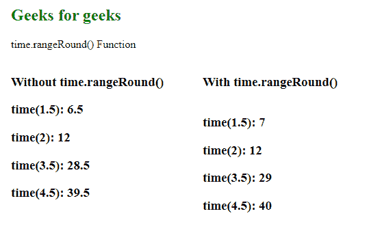
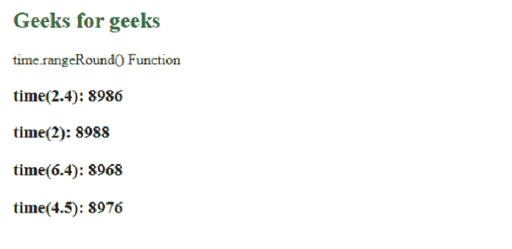

# D3.js time.rangeRound()函数

> 原文:[https://www . geesforgeks . org/D3-js-time-range round-function/](https://www.geeksforgeeks.org/d3-js-time-rangeround-function/)

**time.rangeRound()** 功能用于将刻度范围设置为指定的值数组，并将插值器设置为整数。

**语法:**

```
time.rangeRound([range]);
```

**参数:**该函数接受一个上面给定的参数，如下所述。

*   **范围:**此参数接受数字或字符串数组。

**返回值:**这个函数不返回任何东西。

下面是上面给出的函数的几个例子。

**例 1:**

## 超文本标记语言

```
<!DOCTYPE html>
<html lang="en">

<head>
    <meta charset="UTF-8" />
    <meta name="viewport" path1tent="width=device-width, 
        initial-scale=1.0" />
    <script src="https://d3js.org/d3.v4.min.js">
    </script>
    <script src="https://d3js.org/d3-color.v1.min.js">
    </script>
    <script src="https://d3js.org/d3-interpolate.v1.min.js">
    </script>
    <script src="https://d3js.org/d3-scale-chromatic.v1.min.js">
    </script>

    <style>
        body {
            margin-left: 40px;
        }

        h2 {
            color: green;
        }

        div {
            float: left;
            width: 280px;
        }
    </style>
</head>

<body>
    <h2>Geeks for geeks</h2>
    <p>time.rangeRound() Function </p>

    <script>
        var time = d3.scaleTime()
            // Setting domain for the scale.
            .domain([1, 10])
            // Setting the range of the scale.
            .range([1, 100]);

        document.write(
            "<div><h3>Without time.rangeRound()</h3>");
        document.write(
            "<h3>time(1.5): " + time(1.5) + "</h3>");
        document.write(
            "<h3>time(2): " + time(2) + "</h3>");
        document.write(
            "<h3>time(3.5): " + time(3.5) + "</h3>");
        document.write(
            "<h3>time(4.5): " + time(4.5) + "</h3></div>");

        var time = d3.scaleTime()
            // Setting domain for the scale.
            .domain([1, 10])
            // Setting the range of the scale.
            .rangeRound([1, 100]);
        document.write(
            "<div><h3>With time.rangeRound()</h3>");
        document.write(
            "<div><h3>time(1.5): " + time(1.5) + "</h3>");
        document.write(
            "<h3>time(2): " + time(2) + "</h3>");
        document.write(
            "<h3>time(3.5): " + time(3.5) + "</h3>");
        document.write(
            "<h3>time(4.5): " + time(4.5) + "</h3></div>");
    </script>
</body>

</html>
```

**输出:**



**例 2:**

## 超文本标记语言

```
<!DOCTYPE html>
<html lang="en">

<head>
    <meta charset="UTF-8" />
    <meta name="viewport" path1tent=
        "width=device-width, initial-scale=1.0" />

    <script src="https://d3js.org/d3.v4.min.js">
    </script>
    <script src="https://d3js.org/d3-color.v1.min.js">
    </script>
    <script src=
"https://d3js.org/d3-interpolate.v1.min.js">
    </script>
    <script src=
"https://d3js.org/d3-scale-chromatic.v1.min.js">
    </script>

    <style>
        body {
            margin-left: 40px;
        }

        h2 {
            color: green;
        }
    </style>
</head>

<body>
    <h2>Geeks for geeks</h2>
    <p>time.rangeRound() Function </p>
    <script>

        var time = d3.scaleTime()

            // Setting domain for the scale.
            .domain([2001 - 01 - 01, 2000 - 01 - 02])
            .rangeRound([1, 10])
        document.write("<h3>time(2.4): " 
                + time(2.4) + "</h3>");

        document.write("<h3>time(2): " 
                + time(2) + "</h3>");

        document.write("<h3>time(6.4): " 
                + time(6.4) + "</h3>");

        document.write("<h3>time(4.5): " 
                + time(4.5) + "</h3>");
    </script>
</body>

</html>
```

**输出:**

