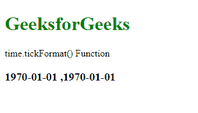
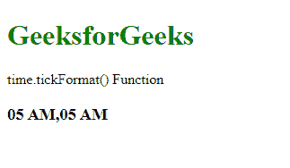

# D3.js time.tickFormat()函数

> 原文:[https://www . geesforgeks . org/D3-js-time-tick format-function/](https://www.geeksforgeeks.org/d3-js-time-tickformat-function/)

**D3.js** 中的 **time.tickFormat()** 功能用于返回适合显示刻度值的时间格式功能。当未指定说明符时，它返回默认时间格式。

**语法:**

```
time.tickFormat( count, specifier )
```

**参数:**该函数接受两个参数，如上所述，如下所述:

*   **计数:**指定刻度值的个数。
*   **说明符:**是将用作说明符的字符串。它的格式类型为“s”。

**返回值:**这个函数不返回任何东西。

下面的程序说明了 D3.js 中的 **time.tickFormat()** 函数:

**例 1:**

## 超文本标记语言

```
<!DOCTYPE html>
<html>

<head>
    <script src="https://d3js.org/d3.v4.min.js">
    </script>
    <script src="https://d3js.org/d3-color.v1.min.js">
    </script>
    <script src=
    "https://d3js.org/d3-interpolate.v1.min.js">
    </script>
    <script src=
    "https://d3js.org/d3-scale-chromatic.v1.min.js">
    </script>
</head>

<body>
    <h1 style="color: green">GeeksforGeeks</h1>

    <p>time.tickFormat() Function </p>

    <script>
        var time = d3.scaleTime()

            // Specify the domain and range
            .domain([2001 - 01 - 01, 2005 - 01 - 02])
            .range([1, 100]);

        var ticks = time.ticks(1);

        // Specify the format of the ticks
        var tickFormat = time.tickFormat(1, "%Y-%m-%d ");

        document.write("<h3>" +
            ticks.map(tickFormat) + "</h3>");
    </script>
</body>

</html>
```

**输出:**



**例 2:**

## 超文本标记语言

```
<!DOCTYPE html>
<html>

<head>
    <script src="https://d3js.org/d3.v4.min.js">
    </script>
    <script src="https://d3js.org/d3-color.v1.min.js">
    </script>
    <script src=
    "https://d3js.org/d3-interpolate.v1.min.js">
    </script>
    <script src=
    "https://d3js.org/d3-scale-chromatic.v1.min.js">
    </script>
</head>

<body>
    <h1 style="color: green">GeeksforGeeks</h1>

    <p>time.tickFormat() Function </p>

    <script>
        var time = d3.scaleTime()

            // Specify the domain and range
            .domain([2001 - 01 - 01, 2005 - 01 - 02])
            .range([1, 100]);

        var ticks = time.ticks(1);

        // Specify the format of the ticks
        var tickFormat = time.tickFormat(0, "%I %p");

        document.write("<h3>" +
            ticks.map(tickFormat) + "</h3>");
    </script>
</body>

</html>
```

**输出:**

