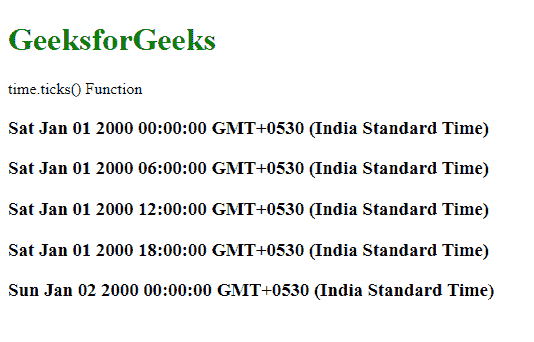
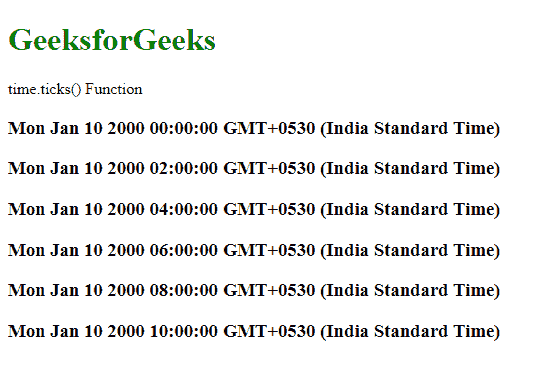

# D3.js time.ticks()函数

> 原文:[https://www.geeksforgeeks.org/d3-js-time-ticks-function/](https://www.geeksforgeeks.org/d3-js-time-ticks-function/)

**time.ticks()** 函数用于统一分隔对应于刻度范围的日期。日期总是在刻度范围内。

**语法:**

```
time.ticks( count )
```

**参数:**该函数接受如上所述的单个参数，如下所述:

*   **计数:**是需要的刻度数。这是一个可选参数。

**返回值:**这个函数不返回任何东西。

以下程序说明了 D3.js 中的 **time.ticks()** 功能:

**例 1:**

## 超文本标记语言

```
<!DOCTYPE html>
<html>

<head>
    <script src="https://d3js.org/d3.v4.min.js">
    </script>
    <script src="https://d3js.org/d3-color.v1.min.js">
    </script>
    <script src=
    "https://d3js.org/d3-interpolate.v1.min.js">
    </script>
    <script src=
    "https://d3js.org/d3-scale-chromatic.v1.min.js">
    </script>
</head>

<body>
    <h1 style="color: green">GeeksforGeeks</h1>

    <p>time.ticks() Function </p>

    <script>
        var time = d3.scaleTime()

            // Set the number of ticks
            .ticks(4);

        // Display the time for each tick
        time.forEach(e => {
            document.write("<h3>" + e + "</h3>")
        });
    </script>
</body>

</html>
```

**输出:**



**例 2:** 每隔一段时间滴答一次。

## 超文本标记语言

```
<!DOCTYPE html>
<html>

<head>
    <script src="https://d3js.org/d3.v4.min.js">
    </script>
    <script src="https://d3js.org/d3-color.v1.min.js">
    </script>
    <script src=
    "https://d3js.org/d3-interpolate.v1.min.js">
    </script>
    <script src=
    "https://d3js.org/d3-scale-chromatic.v1.min.js">
    </script>
</head>

<body>
    <h1 style="color: green">GeeksforGeeks</h1>

    <p>time.ticks() Function </p>

    <script>
        var time = d3.scaleTime()

            // Set the domain of the time to scale  
            .domain([new Date(2000, 0, 10, 0),
            new Date(2000, 0, 10, 10)])

            // Set the number of ticks to every 2 hours
            .ticks(d3.timeHour.every(2))

        // Display the time for each tick
        time.forEach(e => {
            document.write("<h3>" + e + "</h3>")
        });
    </script>
</body>

</html>
```

**输出:**

