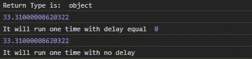
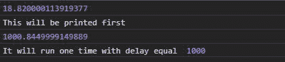

# D3.js 超时()功能

> 原文:[https://www.geeksforgeeks.org/d3-js-timeout-function/](https://www.geeksforgeeks.org/d3-js-timeout-function/)

[D3.js](https://www.geeksforgeeks.org/d3-js-data-driven-documents/) 中的 **d3.timeout()** 功能用于在特定时间间隔后自动停止该功能或计时器。它的工作原理与 JavaScript 中的 [setTimeOut()](https://www.geeksforgeeks.org/java-script-settimeout-setinterval-method/) 函数相同。

**语法:**

```
d3.timeout(callback, delay);

```

**参数:**该函数接受两个参数，如上所述，如下所述:

*   **回调:**是特定延迟后要停止的功能。
*   **延迟:**是功能停止后的时间。

**返回值:**该函数返回一个对象。

下面给出了上述函数的几个例子。

**例 1:** 未给出延迟时。

## 超文本标记语言

```
<!DOCTYPE html>
<html lang="en">

<head>
    <meta charset="UTF-8">
    <meta name="viewport" content=
    "width=device-width, initial-scale=1.0">
</head>

<body>
    <!-- Fetching from CDN of D3.js -->
    <script type="text/javascript" 
        src="https://d3js.org/d3.v4.min.js">
    </script>

    <script>
        let delay = 0
        let func = function (e) {
            console.log(e);
            console.log("It will run one time"
                + " with delay equal ", delay);
        }
        var timer = d3.timeout(func, delay);

        func = function (e) {
            console.log(e);
            console.log(
                "It will run one time with no delay");
        }
        var timer = d3.timeout(func);
        console.log("Return Type is: ", typeof timer);
    </script>
</body>

</html>
```

**输出:**



**例 2:** 给定延时时。

## 超文本标记语言

```
<!DOCTYPE html>
<html lang="en">

<head>
    <meta charset="UTF-8">
    <meta name="viewport" content=
        "width=device-width, initial-scale=1.0">
</head>

<body>
    <!-- Fetching from CDN of D3.js -->
    <script type="text/javascript" 
        src="https://d3js.org/d3.v4.min.js">
    </script>

    <script>
        let delay = 1000
        let func = function (e) {
            console.log(e);
            console.log("It will run one time"
                + " with delay equal ", delay);
        }
        var timer = d3.timeout(func, delay);

        func = function (e) {
            console.log(e);
            console.log("This will be printed first");
        }
        var timer = d3.timeout(func);
    </script>
</body>

</html>
```

**输出:**

