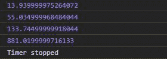
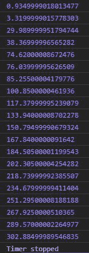

# D3.js 定时器()功能

> 原文:[https://www.geeksforgeeks.org/d3-js-timer-function/](https://www.geeksforgeeks.org/d3-js-timer-function/)

**D3.timer()** 功能用于在特定时间间隔后运行计时器功能。计时器将在指定的延迟后运行。给定的延迟以毫秒为单位。

**语法:**

```
d3.timer(callback, delay);
```

**参数:**取以下两个参数。

*   **回调:**是一个函数。
*   **延迟:**是执行功能后的延迟。

**返回:**返回数据类型号的时间。

下面给出了上述函数的几个例子。

**例 1:**

```
<!DOCTYPE html>
<html lang="en">
<head>
  <meta charset="UTF-8">
  <meta name="viewport"
        content="width=device-width,
                 initial-scale=1.0">
  <title>Document</title>
</head>
<style>
</style>
<body>
  <!-- Fetching from CDN of D3.js -->
  <script type = "text/javascript"
          src = "https://d3js.org/d3.v4.min.js">
  </script>
  <script>
  let func=function(elapsed) {
      console.log(elapsed);
      if (elapsed > 500){
        console.log("Timer stopped")
        timer.stop();
      }
    }
   var timer = d3.timer(func);
  </script>
</body>
</html>
```

**输出:**



**例 2:**

```
<!DOCTYPE html>
<html lang="en">
<head>
  <meta charset="UTF-8">
  <meta name="viewport"
        content="width=device-width,
                 initial-scale=1.0">
  <title>Document</title>
</head>
<style>
  .originalColor{
    height: 100px;
    width: 100px;
  }
  .darkerColor{
    height: 100px;
    width: 100px;
  }
</style>
<body>
  <!-- Fetching from CDN of D3.js -->
  <script type = "text/javascript" 
          src = "https://d3js.org/d3.v4.min.js">
  </script>
  <script>
  let func=function(e) {
      console.log(e);
      if (e>300){
        console.log("Timer stopped")
        timer.stop();
      }
    }
    // Delay of 2000ms
   var timer = d3.timer(func, 2000);
  </script>
</body>
</html>
```

**输出:**

