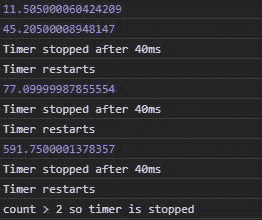
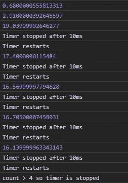

# D3.js 定时器.重启()功能

> 原文:[https://www.geeksforgeeks.org/d3-js-timer-restart-function/](https://www.geeksforgeeks.org/d3-js-timer-restart-function/)

D3.js 中的 **timer.restart()** 功能用于以给定的功能和延迟重启定时器。当想要重置计时器并重新启动时，使用 timer.restart()函数。

**语法:**

```
timer.restart(callback, delay);

```

**参数:**取两个参数，如上所述，如下所述:

*   **回调:**是特定延迟后要停止或启动的功能。
*   **延迟:**是功能执行或停止的时间

**例 1:** 未给出延迟时。

## 超文本标记语言

```
<!DOCTYPE html>
<html lang="en">

<head>
    <meta charset="UTF-8">
    <meta name="viewport" content=
        "width=device-width, initial-scale=1.0">
</head>

<body>
    <!-- Fetching from CDN of D3.js -->
    <script type="text/javascript" 
        src="https://d3js.org/d3.v4.min.js">
    </script>

    <script>
        count = 0;
        let func = function (e) {
            console.log(e)
            if (e > 40) {
                console.log("Timer stopped after 40ms")
                if (e > 40) {
                    count++;

                    // Restarting the timer again
                    console.log("Timer restarts")
                    timer.restart(func)
                }
                if (count > 2) {
                    timer.stop();
                    console.log(
                        "count > 2 so timer is stopped")
                }
            }
        }
        var timer = d3.timer(func);
    </script>
</body>

</html>
```

**输出:**



**例 2:** 当给定延迟时。

## 超文本标记语言

```
<!DOCTYPE html>
<html lang="en">

<head>
    <meta charset="UTF-8">
    <meta name="viewport" content=
        "width=device-width, initial-scale=1.0">
</head>

<body>
    <!-- Fetching from CDN of D3.js -->
    <script type="text/javascript" 
        src="https://d3js.org/d3.v4.min.js">
    </script>

    <script>
        count = 0;
        let func = function (e) {
            console.log(e)
            if (e > 10) {
                console.log("Timer stopped after 10ms")
                if (e > 10) {
                    count++;

                    // Restarting the timer again
                    console.log("Timer restarts")
                    timer.restart(func)
                }
                if (count > 4) {
                    timer.stop();
                    console.log(
                    "count > 4 so timer is stopped")
                }
            }
        }
        // A delay of 2000ms
        var timer = d3.timer(func, 2000);
    </script>
</body>

</html>
```

**输出:**

