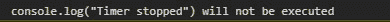
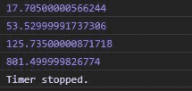

# D3.js 定时器. stop()功能

> 原文:[https://www.geeksforgeeks.org/d3-js-timer-stop-function/](https://www.geeksforgeeks.org/d3-js-timer-stop-function/)

D3.js 中的 **timer.stop()** 函数用于停止当前正在进行的计时器函数，从而防止对该函数的进一步调用。该功能仅在计时器尚未停止的情况下有效。

**语法:**

```
timer.stop()
```

**参数:**不取参数。

**返回:**不返回任何东西。

**注意:**用相同的代码运行不同的时间，输出应该不同。

下面给出了上述函数的几个例子。

**例 1:** 当定时器停止，之后使用 timer.stop()时。

```
<!DOCTYPE html>
<html lang="en">
    <head>
        <meta charset="UTF-8" />
        <meta name="viewport" 
              content="width=device-width,
                       initial-scale=1.0" />
        <title>Document</title>
    </head>
    <style></style>
    <body>
        <!--Fetching from CDN of D3.js-->
        <script type="text/javascript"
                src="https:// d3js.org/d3.v4.min.js">
      </script>
        <script>
            let func = function (e) {
                console.log(
'console.log("Timer stopped") will not be executed');
                if (e > 300) {
                    console.log("Timer stopped");
// This will have no effect as timer is stopped already
                    timer.stop();
                }
                // Timer stopped
                timer.stop();
            };
            // Delay of 2000ms
            var timer = d3.timer(func);
        </script>
    </body>
</html>
```

**输出:**



**例 2:**

```
<!DOCTYPE html>
<html lang="en">
<head>
  <meta charset="UTF-8">
  <meta name="viewport" 
        content="width=device-width, 
                 initial-scale=1.0">
  <title>Document</title>
</head>
<style>
  .originalColor{
    height: 100px;
    width: 100px;
  }
  .darkerColor{
    height: 100px;
    width: 100px;
  }
</style>
<body>
  <!-- Fetching from CDN of D3.js -->
  <script type = "text/javascript" 
          src = "https://d3js.org/d3.v4.min.js">
  </script>
  <script>
  let func=function(e) {
    // Printing time elapsed
    console.log(e)
      if (e>=400){
        console.log("Timer stopped.")
        // Timer stopped
        timer.stop();
      }
    }
  // No delay given
   var timer = d3.timer(func);
  </script>
</body>
</html>
```

**输出:**

