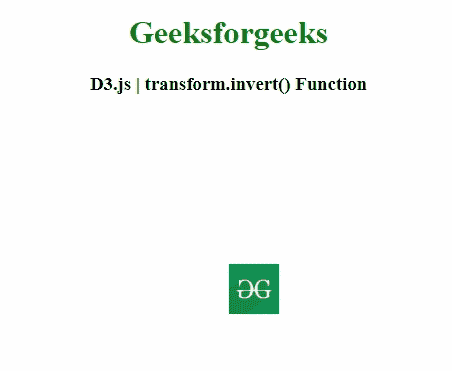
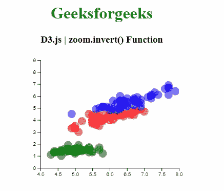

# D3.js transform.invert()函数

> 原文:[https://www . geesforgeks . org/D3-js-transform-invert-function/](https://www.geeksforgeeks.org/d3-js-transform-invert-function/)

**D3.js** 中的 **transform.invert()** 函数用于获取指定点的逆变换，该点是一个二元数字数组[x，y]。返回的点等于[(x–t<sub>x<sub>)/k，(y–t<sub>y</sub>)/k]。</sub></sub>

**语法:**

```
transform.invert( point )
```

**参数:**该功能接受如下参数，如上所述，如下所述:

*   **x:** 此参数是指定的点，它是一个由数字[x，y]组成的二元数组。

**返回值:**该函数返回变换后的缩放行为。

以下程序说明了 **D3.js.** 中的 **transform.invert()** 功能

**例 1:**

```
<!DOCTYPE html> 
<html> 
<head> 
    <meta charset="utf-8">
    <script src="https://d3js.org/d3.v4.min.js"> 
    </script>

    <script src=
"https://cdnjs.cloudflare.com/ajax/libs/d3/5.7.0/d3.min.js">
    </script>
</head> 

<body> 
    <center>
        <h1 style="color: green;"> 
            Geeksforgeeks 
        </h1> 

        <h3>D3.js | transform.invert() Function</h3>

        <svg width="300" height="300">
          <g>
            <image xlink:href=
"https://media.geeksforgeeks.org/wp-content/cdn-
uploads/20190710102234/download3.png"
                x="150" y="150" width="50" height="50">
            </image>
          </g>
        </svg>

        <script>
            var zoom = d3.zoom()
                .on("zoom", zoomed);

            var svg = d3.select("svg").call(zoom),
                g = svg.select("g"),
                image = g.select("image"),
                width = +svg.attr("width"),
                height = +svg.attr("height"),
                x0 = +image.attr("x"),
                y0 = +image.attr("y"),
                x1 = +image.attr("width") + x0,
                y1 = +image.attr("height") + y0;

            zoom.scaleExtent([1, Math.min(width / 
                (x1 - x0), height / (y1 - y0))]);

            function zoomed() {
              var t = d3.event.transform;
              if (t.invert([0, 0]) > [x0, y0]) {
                  t.x = -x0 * t.k;
                  t.y = -y0 * t.k;
              }
              else if (t.invert([width, height]) < [x1, y1]) {
                  t.y = height - y1 * t.k;
                  t.x = width - x1 * t.k;
              }
              g.attr("transform", t);
            }
        </script> 
    </center>
</body> 

</html>
```

**输出:**



**例 2:**

```
<!DOCTYPE html> 
<html> 
<head> 
    <meta charset="utf-8">
    <script src="https://d3js.org/d3.v4.min.js"> 
    </script>

    <style>
        circle {
          opacity: 0.7;
        }
    </style>
</head> 

<body> 
    <center>
        <h1 style="color: green;"> 
            Geeksforgeeks 
        </h1> 

        <h3>D3.js | zoom.invert() Function</h3>

        <div id="GFG"></div>

        <script>
        var margin = {top: 10, right: 30, bottom: 30, left: 60},
            width = 360 - margin.left - margin.right,
            height = 250 - margin.top - margin.bottom;

        var svg = d3.select("#GFG")
            .append("svg")
            .attr("width", width + margin.left + margin.right)
            .attr("height", height + margin.top + margin.bottom)
            .append("g")
            .attr("transform",
                "translate(" + margin.left + ", " + margin.top + ")");

        var myURL = "https://raw.githubusercontent.com/" +
        "holtzy/D3-graph-gallery/master/DATA/iris.csv" 

        d3.csv(myURL, function(data) {
            var x = d3.scaleLinear()
                .domain([4, 8])
                .range([ 0, width ]);

            var xAxis = svg.append("g")
                .attr("transform", "translate(0, " + height + ")")
                .call(d3.axisBottom(x));

            var y = d3.scaleLinear()
                .domain([0, 9])
                .range([ height, 0]);

            svg.append("g")
                .call(d3.axisLeft(y));

            var clip = svg.append("defs")
                .append("svg:clipPath")
                .attr("id", "clip")
                .append("svg:rect")
                .attr("width", width )
                .attr("height", height )
                .attr("x", 0)
                .attr("y", 0);

            var color = d3.scaleOrdinal()
                .domain(["setosa", "versicolor", "virginica" ])
                .range([ "green", "red", "blue"])

            var brush = d3.brushX()                 
                .extent( [ [0, 0], [width, height] ] ) 
                .on("end", updateChart) 

            var scatter = svg.append('g')
                .attr("clip-path", "url(#clip)")

            scatter.selectAll("circle")
                .data(data)
                .enter()
                .append("circle")
                .attr("cx", function (d) {
                    return x(d.Sepal_Length); } )
                .attr("cy", function (d) { 
                    return y(d.Petal_Length); } )
                .attr("r", 8)
                .style("fill", function (d) { 
                    return color(d.Species) } )
                .style("opacity", 0.5)

            scatter.append("g")
                .attr("class", "brush")
                .call(brush);

            var idleTimeout

            function idled() { idleTimeout = null; }

            function updateChart() {

                extent = d3.event.selection

                if(!extent){
                    if (!idleTimeout)
                        return idleTimeout = 
                        setTimeout(idled, 350); 
                    x.domain([ 4, 8])
                }
                else{
                    x.domain([ x.invert(extent[0]),
                    x.invert(extent[1]) ])
                    scatter.select(".brush")
                        .call(brush.move, null) 
                }

                xAxis.transition()
                    .duration(1000)
                    .call(d3.axisBottom(x))

                scatter.selectAll("circle")
                    .transition().duration(1000)
                    .attr("cx", function (d) { 
                        return x(d.Sepal_Length);
                    } )
                    .attr("cy", function (d) { 
                        return y(d.Petal_Length);
                    } )
                }
            })
        </script> 
    </center>
</body> 

</html>
```

**输出:**

