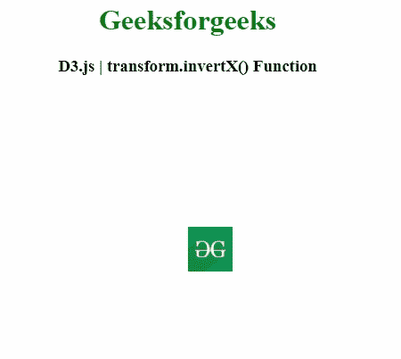
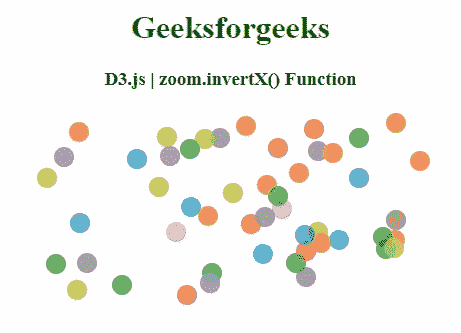

# D3.js transform.invertX()函数

> 原文:[https://www . geesforgeks . org/D3-js-transform-invertx-function/](https://www.geeksforgeeks.org/d3-js-transform-invertx-function/)

**D3.js** 中的 **transform.invertX()** 函数用于获取指定 x 坐标的逆变换，(x–tx)/k

**语法:**

```
transform.invertX(x)

```

**参数:**该功能接受如下参数，如上所述，如下所述:

*   **x:** 该参数为 x 坐标。

**返回值:**该函数返回变换后的缩放行为。

以下程序说明了 **D3.js.** 中的 **transform.invertX()** 功能

**例 1:**

```
<!DOCTYPE html>
<html>

<head>
    <meta charset="utf-8">
    <script src="https://d3js.org/d3.v4.min.js">
    </script>

    <script src=
"https://cdnjs.cloudflare.com/ajax/libs/d3/5.7.0/d3.min.js">
    </script>
</head>

<body>
    <center>
        <h1 style="color: green;">
            Geeksforgeeks
        </h1>

        <h3>D3.js | transform.invertX() Function</h3>

        <svg width="300" height="300">
            <g>
                <image xlink: href=
"https://media.geeksforgeeks.org/wp-content/cdnuploads/20190710102234/download3.png"
            x="150" y="150" width="50" height="50">
                </image>
            </g>
        </svg>

        <script>
            var zoom = d3.zoom()
                .on("zoom", zoomed)
                .constrain(constr);

            var svg = d3.select("svg").call(zoom),
                g = svg.select("g"),
                image = g.select("image"),
                width = +svg.attr("width"),
                height = +svg.attr("height"),
                x0 = +image.attr("x"),
                y0 = +image.attr("y"),
                x1 = +image.attr("width") + x0,
                y1 = +image.attr("height") + y0;

            zoom.scaleExtent([1, Math.min(width /
                (x1 - x0), height / (y1 - y0))]);

            function zoomed() {
                var t = d3.event.transform;
                if (t.invertX(0) > x0)
                    t.x = -x0 * t.k;
                else if (t.invertX(width) < x1)
                    t.x = width - x1 * t.k;
                if (t.invertY(0) > y0)
                    t.y = -y0 * t.k;
                else if (t.invertY(height) < y1)
                    t.y = height - y1 * t.k;
                g.attr("transform", t);
            }

            function constr(transform, extent, 
                            translateExtent) {
                var dx0 = transform.invertX(extent[0][0])
                                - translateExtent[0][0],

                    dy0 = transform.invertY(extent[0][1])
                                - translateExtent[0][1],

                    dx1 = transform.invertX(extent[1][0])
                                - translateExtent[1][0],

                    dy1 = transform.invertY(extent[1][1])
                                - translateExtent[1][1];

                return transform.translate(
                    dx1 > dx0 ? (dx1 + dx0) / 2 : 
                        Math.min(0, dx0) || Math.max(0, dx1),

                    dy1 > dy0 ? (dy1 + dy0) / 2 : 
                        Math.min(0, dy0) || Math.max(0, dy1)
                );
            }
        </script>
    </center>
</body>

</html>
```

**输出:**



**例 2:**

```
<!DOCTYPE html>
<html>

<head>
    <meta charset="utf-8">
    <script src="https://d3js.org/d3.v4.min.js">
    </script>

    <style>
        circle {
            opacity: 0.7;
        }
    </style>
</head>

<body>
    <center>
        <h1 style="color: green;">
            Geeksforgeeks
        </h1>

        <h3>D3.js | zoom.invertX() Function</h3>

        <svg></svg>

        <script>
            function getRandom(min, max) {
                min = Math.ceil(min);
                max = Math.floor(max);
                return Math.floor(Math.random() 
                    * (max - min + 1)) + min;
            }

            function mydata(transform, extent, 
                            translateExtent) {
                var dx0 = transform.invertX(extent[0][0])
                                - translateExtent[0][0],

                    dy0 = transform.invertY(extent[0][1]) 
                                - translateExtent[0][1],

                    dx1 = transform.invertX(extent[1][0]) 
                                - translateExtent[1][0],

                    dy1 = transform.invertY(extent[1][1]) 
                                - translateExtent[1][1];

                return transform.translate(
                    dx1 > dx0 ? (dx1 + dx0) / 2 : 
                        Math.min(0, dx0) || Math.max(0, dx1),

                    dy1 > dy0 ? (dy1 + dy0) / 2 : 
                        Math.min(0, dy0) || Math.max(0, dy1)
                );
            }

            var dimension = document.body
                .getBoundingClientRect();

            var radius = 10;
            var svg = d3.select('svg');

            var data = d3.range(0, 50).map(function () {
                return {
                    x: getRandom(radius, 400 - radius),
                    y: getRandom(radius, 200 - radius)
                }
            });

            var zoom = d3.zoom()
                .constrain(mydata)
                .on('zoom', function () {
                    canvas.attr('transform', d3.event.transform);
                })

            var canvas = svg.attr('width', 400)
                .attr('height', 200)
                .call(zoom)
                .insert('g', ':first-child');

            canvas.selectAll('circle')
                .data(data)
                .enter()
                .append('circle')
                .attr('r', radius)
                .attr('cx', function (d) {
                    return d.x;
                })
                .attr('cy', function (d) {
                    return d.y;
                })
                .style('fill', function () {
                    return d3.schemeCategory10[getRandom(0, 5)]
                });
        </script>
    </center>
</body>

</html>
```

**输出:**

