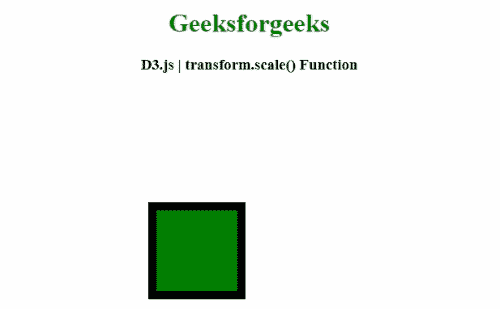
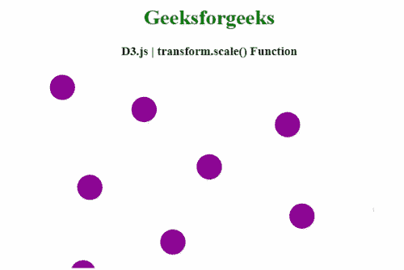

# D3.js 变换. scale()函数

> 原文:[https://www . geesforgeks . org/D3-js-transform-scale-function/](https://www.geeksforgeeks.org/d3-js-transform-scale-function/)

使用 **D3.js** 库中的 **transform.scale()** 函数来获取其比例 k₁等于 k₀k 的变换，其中 k₀是变换的比例。

**语法:**

```
 transform.scale(k)

```

**参数:**该函数接受一个参数，如上所述，如下所述。

*   **k:** 此参数为刻度参数。

**返回值:**该函数返回变换后的缩放行为。

下面的程序说明了 **D3.js** 库中的 **transform.scale()** 功能。

**例 1:**

## 超文本标记语言

```
<!DOCTYPE html>
<html>

<head>
    <meta charset="utf-8">

    <script src="https://d3js.org/d3.v4.min.js">
    </script>

</head>

<body>
    <center>
        <h1 style="color: green;">
            Geeksforgeeks
        </h1>

        <h3>D3.js | transform.scale() Function</h3>

        <script>
            var svg = d3.select("body").append("svg")
                .attr("width", 400)
                .attr("height", 300);

            var g1 = svg.append("g"), g2 = svg.append("g");

            var zoom1 = d3.zoom().on("zoom", function () {
                g1.attr("transform", d3.event.transform);
            });

            var zoom2 = d3.zoom().on("zoom", function () {
                g2.attr("transform", d3.event.transform);
            });

            g1.call(zoom1.transform, d3.zoomIdentity
                .translate(150, 100)
                .scale(2));

            g2.call(zoom2.transform, d3.zoomIdentity
                .translate(150, 100)
                .scale(2));

            g1.append("rect")
                .attr("x", 20)
                .attr("y", 20)
                .attr("width", 60)
                .attr("height", 60);

            g2.append("rect")
                .attr("x", 25)
                .attr("y", 25)
                .attr("width", 50)
                .attr("height", 50)
                .attr("fill", "green");

            d3.selectAll("rect").on("click", function () {

                g1.transition()
                    .duration(3000)
                    .attr("transform", d3.zoomIdentity)
                    .on("end", function () {
                        d3.select(this).call(zoom1.transform,
                            d3.zoomIdentity);
                    })

                g2.transition()
                    .duration(2000)
                    .call(zoom2.transform, 
                            d3.zoomIdentity)
            });
        </script>
    </center>
</body>

</html>
```

**输出:**



**例 2:**

## 超文本标记语言

```
<!DOCTYPE html>
<html>

<head>
    <meta charset="utf-8">

    <script src="https://d3js.org/d3.v4.min.js">
    </script>
</head>

<body>
    <center>
        <h1 style="color: green;">
            Geeksforgeeks
        </h1>

        <h3>D3.js | transform.scale() Function</h3>

        <canvas width="500" height="300"></canvas>

        <script>
            var canvas = d3.select("canvas"),
                context = canvas.node().getContext("2d"),
                width = canvas.property("width"),
                height = canvas.property("height"),
                radius = 2.5;

            var points = d3.range(300).map(phyllotaxis(10)),
                point = points.pop();

            var zoom = d3.zoom()
                .on("zoom", zoomed);

            canvas
                .call(zoom.transform, transform)
                .call(transition);

            function zoomed() {
                context.save();
                context.clearRect(0, 0, width, height);
                context.translate(d3.event.transform.x,
                    d3.event.transform.y);
                context.scale(d3.event.transform.k,
                    d3.event.transform.k);
                drawPoints();
                context.restore();
            }

            function drawPoints() {
                context.beginPath();
                points.forEach(drawPoint);
                context.fillStyle = "#8d0396";
                context.fill();

                context.beginPath();
                drawPoint(point);
                context.fillStyle = "#00ab1c";
                context.fill();
                context.stroke();
            }

            function drawPoint(point) {
                context.moveTo(point[0] + radius, point[1]);
                context.arc(point[0], point[1], 
                        radius, 0, 2 * Math.PI);
            }

            function transform() {
                return d3.zoomIdentity
                    .translate(width / 2, height / 2)
                    .scale(8)
                    .translate(-point[0], -point[1]);
            }

            function transition(canvas) {
                var n = points.length,
                    i = Math.random() * n | 0,
                    c = points[i]; // Pick a random point.

                points[i] = points[n - 1];
                points[n - 1] = point;
                point = c;

                canvas.transition()
                    .delay(500)
                    .duration(3000)
                    .call(zoom.transform, transform)
                    .on("end", function () 
                        { canvas.call(transition); });
            }

            function phyllotaxis(radius) {
                var theta = Math.PI * (3 - Math.sqrt(5));
                return function (i) {
                    var r = radius * Math.sqrt(i), 
                            a = theta * i;
                    return [
                        width / 2 + r * Math.cos(a),
                        height / 2 + r * Math.sin(a)
                    ];
                };
            }
        </script>
    </center>
</body>

</html>
```

**输出:**

