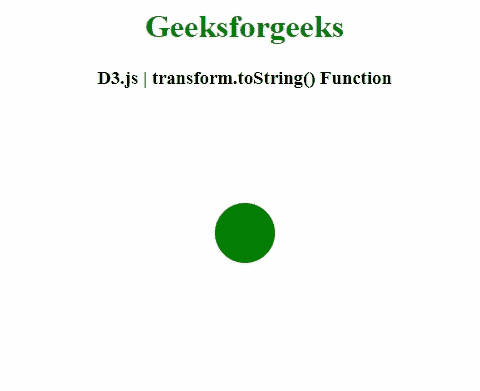
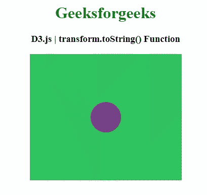

# D3.js transform.toString()函数

> 原文:[https://www . geesforgeks . org/D3-js-transform-tostring-function/](https://www.geeksforgeeks.org/d3-js-transform-tostring-function/)

**D3.js** 中的**变换. toString()** 函数用于获取表示该变换对应的 SVG 变换的字符串。

**语法:**

```
transform.toString()

```

**参数:**此功能不接受任何参数。

**返回值:**这个函数返回一个字符串值，可以用来设置缩放行为。

以下程序说明了 **D3.js.** 中的 **transform.toString()** 功能

**例 1:**

## 超文本标记语言

```
<!DOCTYPE html> 
<html> 
<head> 
    <meta charset="utf-8">

    <script src=
        "https://d3js.org/d3.v4.min.js"> 
    </script>   
</head> 

<body> 
    <center>
        <h1 style="color: green;"> 
            Geeksforgeeks 
        </h1> 

        <h3>D3.js | transform.toString() Function</h3>

        <svg width="400" height="250"></svg>

        <script>
            var svg = d3.select("svg"),
                width = +svg.attr("width"),
                height = +svg.attr("height");

            var radius = 30;    
            var circle = {x: 200, y: height /2 } ; 

            var circle = svg.append("circle")
                .attr("cx", circle.x)
                .attr("cy", circle.y)
                .attr("r", radius)
                .attr("fill", "green");

            // Defining zoom behaviour 
            var zoom_handler = d3.zoom()
                .on("zoom", zoom_actions);

            zoom_handler(circle);

            function zoom_actions(){
                var transform = d3.event.transform; 

                // Setting attribute using this method
                this.setAttribute("transform", 
                           transform.toString());
            }

        </script> 
    </center>
</body> 

</html>
```

**输出:**



**例 2:**

## 超文本标记语言

```
<!DOCTYPE html> 
<html> 

<head> 
    <meta charset="utf-8">

    <script src=
        "https://d3js.org/d3.v4.min.js"> 
    </script>

    <style>
        circle {
          opacity: 0.7;
          fill: #9a05a3;
        }
    </style>
</head> 

<body> 
    <center>
        <h1 style="color: green;"> 
            Geeksforgeeks 
        </h1> 

        <h3>D3.js | transform.toString() Function</h3>

        <svg></svg>

        <script>
            var transform = d3.zoomIdentity
                .translate(100, 0).scale(1);

            var zoom = d3.zoom().on("zoom", handleZoom);

            var svg = d3.select("svg")
              .attr('width', 300)
              .attr('height', 250)
              .style("background", "#31c460")
              .call(zoom)                      
              .call(zoom.transform, transform);

            var zoomable = svg
              .append("g")
              .attr("class", "zoomable")
              .attr("transform", transform);   

            var circles = zoomable.append('circle')
              .attr("id", "circles")
              .attr("cx", 50)
              .attr("cy", 125)
              .attr('r', 30);

            function handleZoom(){
              if (zoomable) {
                // Setting attribute using this method
                zoomable.attr("transform", 
                    d3.event.transform.toString());
              }
            };
        </script> 
    </center>
</body> 

</html>
```

**输出:**

