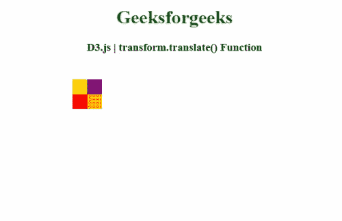
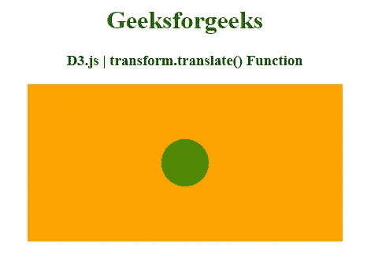

# D3.js transform.translate()函数

> 原文:[https://www . geesforgeks . org/D3-js-transform-translate-function/](https://www.geeksforgeeks.org/d3-js-transform-translate-function/)

**D3.js** 库中的 **transform.translate()** 函数用于获取其翻译 *tx1* 和 *ty1* 等于 *tx0 + tk x* 和 *ty0 + tk y* 的变换，其中 *tx0* 和 *ty0* 是变换的翻译， *tk* 是变换的比例。

**语法:**

```
transform.translate(x, y)
```

**参数:**该函数接受如下参数，如上所述，如下所述。

*   **x，y:** 这些参数是平移点自变量。

**返回值:**该函数返回变换后的缩放行为。

下面的程序演示了 **D3.js** 库的 **transform.translate()** 功能。

**例 1:**

## 超文本标记语言

```
<!DOCTYPE html>
<html>

<head>
    <meta charset="utf-8">

    <title>
        D3.js | transform.translate() Function
    </title>

    <script src="https://d3js.org/d3.v4.min.js">
    </script>

    <script src=
"https://cdnjs.cloudflare.com/ajax/libs/d3/3.4.11/d3.min.js">
    </script>

</head>

<body>
    <center>
        <h1 style="color: green;">
            Geeksforgeeks
        </h1>

        <h3>D3.js | transform.translate() Function</h3>

        <svg height="200px" width="400px">
            <g id="GFG" transform=
                "translate(25,25) scale(0.25)">
            </g>
        </svg>

        <script>
            var svg = d3.select("#GFG");

            svg.append("rect").attr({ 
                "x": 0, "y": 0, "height": 100, 
                "width": 100, "fill": "yellow" 
            })

            svg.append("rect").attr({ 
                "x": 100, "y": 100, "height": 100, 
                "width": 100, "fill": "orange" 
            })

            svg.append("rect").attr({ 
                "x": 0, "y": 100, "height": 100, 
                "width": 100, "fill": "red" 
            })

            svg.append("rect").attr({ 
                "x": 100, "y": 0, "height": 100, 
                "width": 100, "fill": "purple" 
            })

            var zoom = d3.behavior.zoom()
                    .on("zoom", function () {
                var val_1 = d3.event.translate;
                var val_scale = d3.event.scale;

                svg.attr("transform", "translate(" 
                    + val_1[0] + "," + val_1[1] 
                    + ") scale(" + val_scale + ")")

            })
                .scaleExtent([1, 10])
                    .scale(1).translate([0, 0])

            d3.select("svg").call(zoom)

            d3.selectAll("rect").on("mousedown", 
            function () {
                var scale = Math.random() * 3;
                var translate = [Math.random() * 10, 
                            Math.random() * 10]
                zoom.scale(scale);
                zoom.translate(translate);

                // New transition
                var T = svg.transition().duration(500)
                zoom.event(T);
            })
        </script>
    </center>
</body>

</html>
```

**输出:**



**例 2:**

## 超文本标记语言

```
<!DOCTYPE html>
<html>

<head>
    <meta charset="utf-8">

    <title>
        D3.js | transform.translate() Function
    </title>

    <script src="https://d3js.org/d3.v4.min.js">
    </script>

    <style>
        circle {
            opacity: 0.7;
            fill: green;
        }
    </style>

</head>

<body>
    <center>
        <h1 style="color: green;">
            Geeksforgeeks
        </h1>

        <h3>D3.js | transform.translate() Function</h3>

        <svg></svg>

        <script>
            var transform = d3.zoomIdentity
                .translate(100, 0).scale(1);

            var zoom = d3.zoom().on("zoom", handleZoom);

            var svg = d3.select("svg")
                .attr('width', 400)
                .attr('height', 200)
                .style("background", "orange")
                .call(zoom)
                .call(zoom.transform, transform);

            var zoomable = svg
                .append("g")
                .attr("class", "zoomable")
                .attr("transform", transform);

            var circles = zoomable.append('circle')
                .attr("id", "circles")
                .attr("cx", 100)
                .attr("cy", 100)
                .attr('r', 30);

            function handleZoom() {
                if (zoomable) {
                    zoomable.attr("transform", 
                            d3.event.transform);
                }
            };
        </script>
    </center>
</body>

</html>
```

**输出:**

