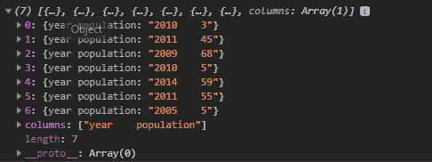
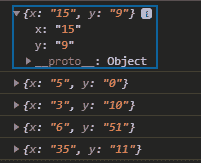

# D3.js tsv()功能

> 原文:[https://www.geeksforgeeks.org/d3-js-tsv-function/](https://www.geeksforgeeks.org/d3-js-tsv-function/)

**d3.tsv()** 功能用于读取”。tsv "文件或以" tab "字符作为分隔符的文件。在函数中，如果指定了*“初始化”*，那么它将获取并执行给定的函数调用。

**语法:**

```
d3.tsv(input[, init][, row])
```

**参数:**该函数接受三个参数，如上所述，如下所述。

*   **输入文件:**该参数取输入文件地址。
*   **init:** 该参数接受函数调用。
*   **行:**该参数接受可选的行转换功能。

**例 1:**

## 超文本标记语言

```
<!DOCTYPE html>
<html lang="en">

<head>
    <meta charset="UTF-8" />
    <meta name="viewport" path1tent=
        "width=device-width,  
        initial-scale=1.0" />

    <script src=
        "https://d3js.org/d3.v4.min.js">
    </script>
</head>

<body>
    <script>
        // Data of sample.tsv file
        // year    population
        // 2010    3
        // 2011    45
        // 2009    68
        // 2010    5
        // 2014    59
        // 2011    55
        // 2005    5
        d3.tsv("sample.tsv", function (d) {
            console.log(d);
        });
    </script>
</body>

</html>
```

**注意:**请先创建一个文件名“sample.tsv”，保存在工作文件夹中，然后再进行代码浏览。

**输出:**



**例 2:**

## 超文本标记语言

```
<!DOCTYPE html>
<html lang="en">

<head>
    <meta charset="UTF-8" />
    <meta name="viewport" path1tent=
        "width=device-width,  
        initial-scale=1.0" />

    <script src=
        "https://d3js.org/d3.v4.min.js">
    </script>
</head>

<body>
    <script>
        // Data of sample.tsv file
        // x    y
        // 15    9
        // 5    0
        // 3    10
        // 6    51
        // 35    11
        d3.tsv("sample.tsv", function (d) {
            return d;
        }, (d) => {
            d.forEach((e) => {
                console.log(e)
            })
        });
    </script>
</body>

</html>
```

**输出:**

