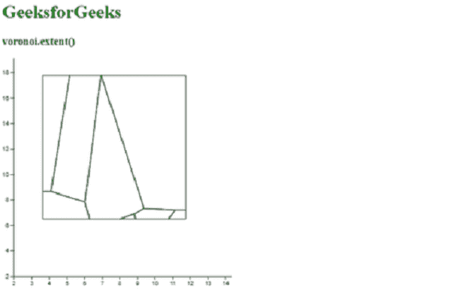
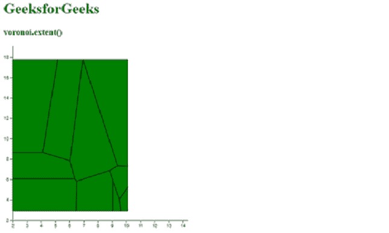

# D3.js voronoi.extent()函数

> 原文:[https://www . geesforgeks . org/D3-js-Voronoi-extend-function/](https://www.geeksforgeeks.org/d3-js-voronoi-extent-function/)

**voronoi . extension()**功能用于设置 Voronoi 生成器功能的范围。给定范围值用于在给定范围内设置沃罗诺伊布局的剪辑范围。边界以二维数组的形式给出，看起来像[[x0，y0]，[x1，y1]]。如果未指定范围，则返回默认值为空的当前剪辑范围。

**语法:**

```
d3.voronoi().extent([extent]);

```

**参数:**该函数取一个参数，如上所述，如下所述。

*   **范围:**表示要裁剪的区域。它采用二维数组的形式。

**返回值:**这个函数不返回任何东西。

**注意:**请创建一个“data.csv”文件。文件的数据在下面的代码中给出。

下面给出了几个函数的例子。

**例 1:**

## 超文本标记语言

```
<!DOCTYPE html> 
<html lang="en"> 

<head> 
    <meta charset="UTF-8"> 
    <meta name="viewport" content=" 
        width=device-width, initial-scale=1.0"> 

    <script type="text/javascript"
        src="https://d3js.org/d3.v4.min.js"> 
    </script>
    <script src="https://d3js.org/d3-voronoi.v1.min.js">
    </script>
</head> 

<body> 
    <h1 style="color:green">GeeksforGeeks</h1>
    <h3 style="color:green">voronoi.extent()</h3>

    <script> 
        d3.csv("data.csv", function(error, data){
            var svg = d3.select("body")
                        .append("svg")
                        .attr("height", 400)
                        .attr("width", 400)
                        .append("g")
                        .attr("transform", 
                     "translate(" + 20 + ", " + -20 + ")");

            var y = d3.scaleLinear()
                      .domain([2, 20])
                      .range([400, 0]);
            var x = d3.scaleLinear()
                      .domain([2, 15])
                      .range([0, 400]);
            svg.append("g")
                    .call(d3.axisLeft(y));

            svg.append("g")
                    .attr("transform", 
                     "translate(0, " + 400 + ")")
                    .call(d3.axisBottom(x));
            var voronoi = d3.voronoi()
                        .x(function(d) { return x(d.x); });
                  voronoi.y(function(d) { return y(d.y); })
                // Setting the extent using voronoi.extent() 
                .extent([[50, 50], [300, 300]]);

            svg.append("g").selectAll("path")
                .data(voronoi(data).polygons())
                .enter()
                .append("path")
                .attr("d", (d)=>{ return d ? 
                ("M" + d.join("L") + "Z") : null; })
                .attr("fill", "none")
                .attr("stroke", "black");
        });

        // Data for CSV file
        // x, y, group
        // 45, 4.4, H
        // 9.1, 4.4, H
        // 9.9, 9.9, H
        // 4.45, 9.6, H
        // 4, 7.6, H
        // 9, 45, H
        // 4, 9.7, H
        // 9.7, 4.7, H
        // 9.9, 4.5, H
        // 4, 4.5, H
        // 7.9, 9, H
        // 9.9, 45, H
        // 9, 4.4, H
    </script> 
</body>
</html> 
```

**输出:**



**例 2:**

## 超文本标记语言

```
<!DOCTYPE html> 
<html lang="en"> 

<head> 
    <meta charset="UTF-8"> 
    <meta name="viewport" content=" 
        width=device-width, initial-scale=1.0"> 

    <script type="text/javascript"
        src="https://d3js.org/d3.v4.min.js"> 
    </script>
    <script src="https://d3js.org/d3-voronoi.v1.min.js">
    </script>
</head> 

<body> 
    <h1 style="color:green">GeeksforGeeks</h1>
    <h3 style="color:green">voronoi.extent()</h3>

    <script> 
        d3.csv("data.csv", function(error, data){
            var svg = d3.select("body")
                        .append("svg")
                        .attr("height", 400)
                        .attr("width", 400)
                        .append("g")
                        .attr("transform", "translate
                        (" + 20 + ", " + -20 + ")");

            var y = d3.scaleLinear()
                      .domain([2, 20])
                      .range([400, 0]);
            var x = d3.scaleLinear()
                      .domain([2, 15])
                      .range([0, 400]);
            svg.append("g")
                    .call(d3.axisLeft(y));

            svg.append("g")
                    .attr("transform", "translate(0, " + 400 + ")")
                    .call(d3.axisBottom(x));

            var voronoi = d3.voronoi()
                            .x(function(d) { return x(d.x); });
                voronoi.y(function(d) { return y(d.y); })
                // Setting the extent using voronoi.extent() function 
                .extent([[0, 50], [250, 380]]);

            svg.append("g").selectAll("path")
                .data(voronoi(data).polygons())
                .enter()
                .append("path")
                .attr("d", (d)=>{ return d ? ("M" + d.join("L") + "Z") : null; })
                .attr("fill", "green")
                .attr("stroke", "black");
        });

        // Data for CSV file
        // x, y, group
        // 45, 4.4, H
        // 9.1, 4.4, H
        // 9.9, 9.9, H
        // 4.45, 9.6, H
        // 4, 7.6, H
        // 9, 45, H
        // 4, 9.7, H
        // 9.7, 4.7, H
        // 9.9, 4.5, H
        // 4, 4.5, H
        // 7.9, 9, H
        // 9.9, 45, H
        // 9, 4.4, H
    </script> 
</body> 
</html> 
```

**输出:**

